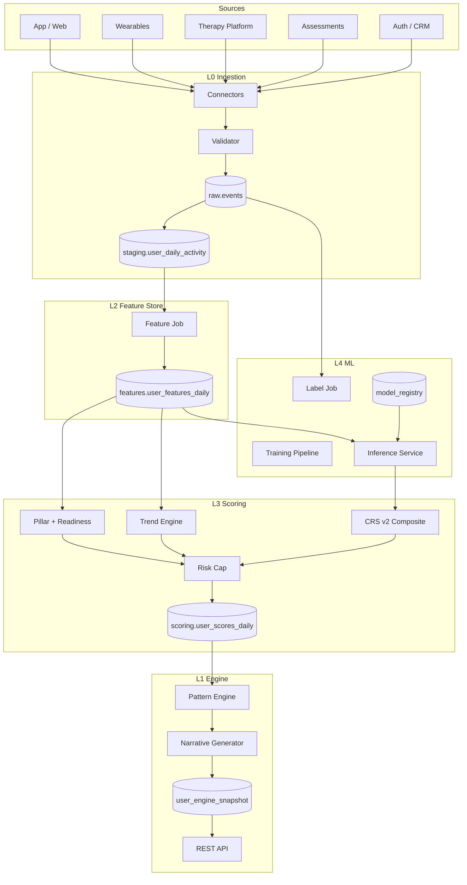

# Master Program HLD — MindPeers Cognitive Readiness Engine

**Document ID:** MP-ENGINE-HLD-000  
**Version:** 1.0.0  
**Status:** For review  
**Date:** 2026-06-05

---

## 1. Architecture overview



---

## 2. Layer responsibilities

| Layer | Runtime | Input | Output |
|-------|---------|-------|--------|
| L0 | Stream + batch | Source APIs / webhooks | `staging.*` |
| L2 | Batch 02:00 UTC | Staging | Feature row |
| L4 labels | Batch 02:15 UTC | Raw assessments + events | `ml.training_labels` |
| L4 inference | Batch 02:30 UTC | Features + models | Probabilities |
| L3 | Batch 02:45 UTC | Features + probabilities | Scores + trends |
| L1 | Batch 03:00–03:05 UTC | L3 output | Snapshot + API |

---

## 3. Daily batch schedule (UTC)

| Time | Job | Idempotent key |
|------|-----|----------------|
| Continuous | L0 stream ingest | `idempotency_key` per event |
| 01:30 | Staging finalize | `batch_date` |
| 02:00 | L2 features | `(user_id, as_of_date, feature_version)` |
| 02:15 | Label generation | `(user_id, snapshot_date, label_version)` |
| 02:30 | ML inference | `(user_id, as_of_date, model_bundle_version)` |
| 02:45 | L3 scoring | `(user_id, as_of_date, score_version)` |
| 03:00 | L1 patterns | `(user_id, as_of_date)` |
| 03:05 | Snapshot persist | `(user_id, as_of_date)` |

Orchestrator: Airflow / Dagster / cloud scheduler (implementation choice).

---

## 4. Technology stack (recommended)

| Concern | Recommendation | Rationale |
|---------|----------------|-----------|
| Event bus | Kafka / Kinesis | Durable stream, replay |
| Raw store | PostgreSQL + object storage | ACID + large payloads |
| Warehouse | BigQuery / Snowflake / Redshift | Analytics + ML features |
| Feature store | Warehouse tables (v1) | Simplicity; Feast optional v2 |
| ML training | Python + XGBoost/LightGBM | Spec §5 |
| Model registry | MLflow / cloud ML | Version audit |
| Scoring service | Python batch job → SQL | Determinism |
| API | FastAPI / Go + Redis cache | Read-heavy snapshot |
| Secrets | Vault / cloud secrets | PHI credentials |

---

## 5. Security architecture

```
┌─────────────┐     TLS      ┌─────────────┐     private     ┌──────────────┐
│ Mobile/Web  │ ──────────► │ API Gateway │ ───────────────► │ L1 API       │
└─────────────┘              └─────────────┘                  └──────┬───────┘
                                                                    │ read
                                                             ┌──────▼───────┐
                                                             │ Snapshot DB  │
                                                             │ (encrypted)  │
                                                             └──────────────┘

Connectors ──► mTLS / API keys ──► Source systems
PHI fields encrypted at rest; journal blobs in separate store
RBAC: API scoped by user_id; batch jobs use service accounts
```

---

## 6. Deployment model

| Environment | Purpose | Data |
|-------------|---------|------|
| dev | Feature development | Synthetic |
| staging | Integration + shadow | Anonymized subset |
| prod | Live users | Full PHI controls |

Blue/green for API; batch jobs versioned by `score_version` flag.

---

## 7. Observability

| Signal | Tool pattern | Alert |
|--------|--------------|-------|
| Ingestion lag | Metrics per connector | > 15 min |
| Validation quarantine rate | Counter | > 2% daily |
| Batch job duration | Span per stage | SLA miss |
| Null feature rate | Per-column gauge | > 15% any required |
| CRS distribution drift | KL divergence | > 0.1 |
| Model AUC | Weekly eval | > 5% drop |

---

## 8. Failure modes

| Failure | Detection | Recovery |
|---------|-----------|----------|
| Connector down | Heartbeat missing | Retry + stale data flag on snapshot |
| Batch job fail | Orchestrator alert | Idempotent rerun from failed stage |
| Model corrupt | Inference schema check | Rollback `model_bundle_version` |
| Risk cap misconfig | Clinical audit sample | Hotfix `score_version` |

---

## 9. Phase-to-component map

| Component | Phase 1 | Phase 2 | Phase 3 | Phase 4 | Phase 5 |
|-----------|---------|---------|---------|---------|---------|
| L0 connectors v1 | ● | | | | |
| L2 feature job | ● | | | | |
| L3 pillars + readiness | ● | | | | |
| L3 trends | ● | | | | |
| Label job | | ● | | | |
| Model training | | ● | | | |
| ML inference | | ● | ● | ● | ● |
| CRS v2 composite | | | ● | ● | ● |
| Narrative API | | | ● | ● | ● |
| `crs_primary=v2` | | | | ● | |
| L0 v1.1 connectors | | | | | ● |

---

## 10. References

- Phase HLDs: `final/Phase-*/Phase-*-HLD.md`
- [Engine Architecture Index](../Engine-Architecture-Index.md)
- [CRS Unified v3](../CRS-Calculation-and-Trends-Production-Spec-Unified-v3.md)
