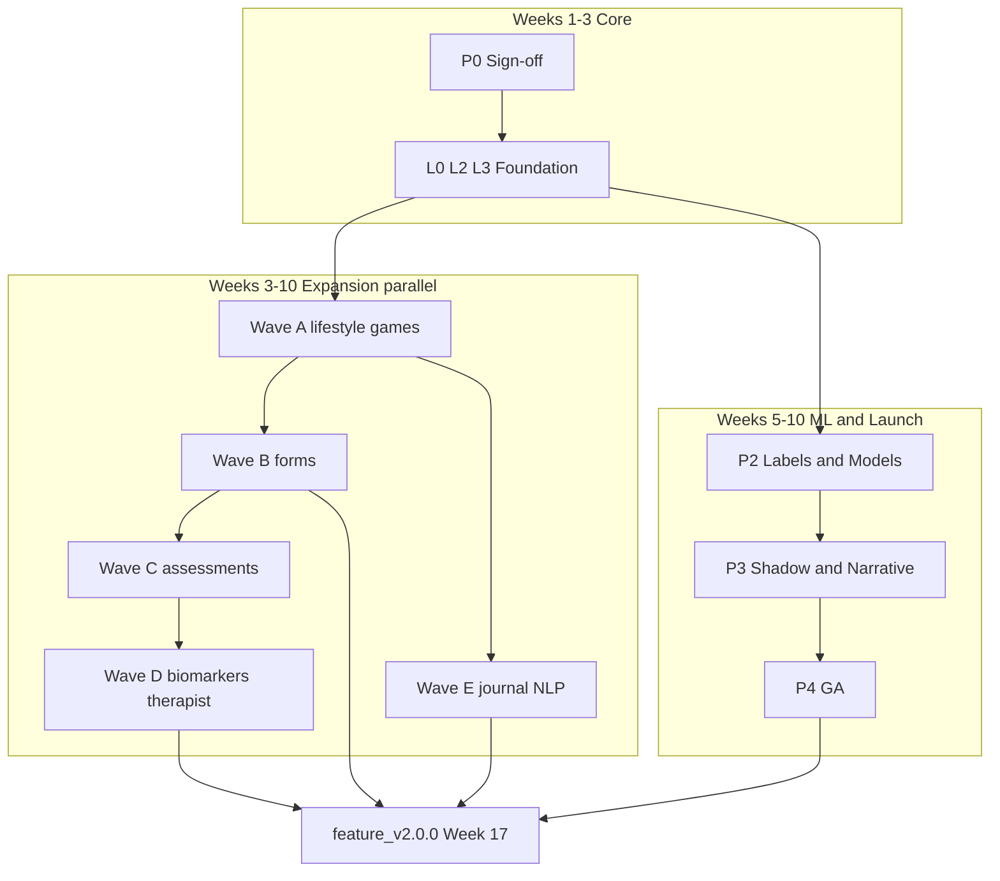
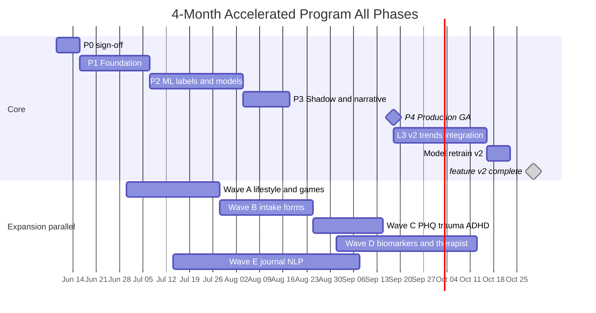

# MindPeers Engine — 4-Month Accelerated Program (All Phases)

**Document ID:** MP-ENGINE-ROADMAP-4M  
**Version:** 1.0.0  
**Status:** For review — aggressive schedule  
**Date:** 2026-06-05  
**Constraint:** 4 months (~17 weeks) · 6 hours/day · 5 days/week (30 h/week per person)  
**Goal:** Complete **Phases 0–5** including **70/70 Part1 attributes** and `feature_v2.0.0`  
**Baseline plan:** [Development-Roadmap.md](./Development-Roadmap.md) (11-week GA + ongoing Phase 5)

---

## Executive summary

| Item | Standard plan | 4-month accelerated |
|------|---------------|---------------------|
| Calendar | 11 weeks GA + 16–28 weeks Phase 5 | **17 weeks total** |
| Part1 at GA | 18/70 (~26%) | 18/70 at week 10 GA |
| Part1 at program end | 70/70 | **70/70 at week 17** |
| Engineers (eng only) | 4 | **8–9** |
| Total eng hours | ~1,000 (GA) | **~3,800–4,200** |
| Risk level | Moderate | **High** — requires parallel squads + frozen specs |

**Verdict:** Achievable only with **8–9 engineers**, **pre-approved specs**, **parallel Phase 5 squads from week 3**, and **acceptance of technical debt** (retrain models once at week 16, not after each wave).

---

## 1. What “all phases complete” means at week 17

| Phase | Done when | Target week |
|-------|-----------|-------------|
| **0** | Clinical thresholds + schemas signed | Week 1 |
| **1** | L0 + L2 (34 cols) + L3 rule-based | Week 3 |
| **2** | Labels + 4 models + inference | Week 7 |
| **3** | CRS v2 shadow + narrative | Week 9 |
| **4** | `crs_primary=v2`, L1 API GA | Week 10 |
| **5** | 70/70 attrs, `feature_v2.0.0`, §8.9 trends | **Week 17** |

---

## 2. Team structure (required)

### 2.1 Core squad (weeks 1–17) — 5 people

| # | Role | Allocation | Owns |
|---|------|------------|------|
| 1 | **Engineering lead / architect** | 30 h/wk | Integration, scoring orchestration, cutover, unblocking |
| 2 | **Backend engineer** | 30 h/wk | L3 scoring, L1 API, narrative, patterns |
| 3 | **Data engineer (platform)** | 30 h/wk | L0 core, L2 v1, batch orchestration, watermarks |
| 4 | **ML engineer** | 30 h/wk | Labels (W5+), training (W5–7), inference, final retrain (W16) |
| 5 | **DevOps / platform** | 15–30 h/wk | Environments, Airflow/Dagster, monitoring, API infra |

### 2.2 Expansion squad (weeks 3–17) — 3–4 people

| # | Role | Allocation | Owns |
|---|------|------------|------|
| 6 | **Data engineer (connectors A+C)** | 30 h/wk | `lifestyle_checkin`, `game_session_completed`, PHQ-9/PTSD/ASRS |
| 7 | **Data engineer (connectors B+D)** | 30 h/wk | `intake_form_submitted`, `biomarker_result`, therapist sync |
| 8 | **Backend / NLP engineer** | 30 h/wk | Journal NLP, app behaviour features, Wave E, form NLP |
| 9 | **QA / data analyst** (optional but recommended) | 20 h/wk | Score regression, golden users, wave sign-off |

**Minimum:** 8 engineers (skip #9, DevOps at 15 h/wk)  
**Recommended:** 9 engineers + part-time Clinical (gates) + Product (copy)

### 2.3 Capacity math

```
17 weeks × 30 h/week = 510 h per engineer
8 engineers × 510 h     = 4,080 h total capacity
Estimated need          = 3,800–4,200 h
Margin                  = thin (~0–7%)
```

---

## 3. Compression tactics (non-negotiable)

| # | Tactic | Saves |
|---|--------|-------|
| 1 | **Specs frozen** — build from `final/` docs only; no scope creep | 2–3 weeks |
| 2 | **Phase 1 in 3 weeks** not 4 — L0/L2/L3 overlap weeks 2–3 | 1 week |
| 3 | **Phase 5 starts week 3** — expansion squad does not wait for GA | 8+ weeks |
| 4 | **Connector factory** — one template; 5 v1.1 events = config + payload map | 3–4 weeks |
| 5 | **L2 column batch PRs** — add 52 cols in 3 batches, not 52 PRs | 2 weeks |
| 6 | **Single model retrain** at week 16 — not after each wave | 2–3 weeks |
| 7 | **Shadow 1 week** not 2 — clinical review pre-scheduled | 1 week |
| 8 | **Biomarker v1** — batch CSV/API import; no custom lab integrations | 2–4 weeks |
| 9 | **Therapist sheet** — Google Sheet sync daily batch; not real-time | 1–2 weeks |
| 10 | **Journal NLP** — existing sentiment API / rules; not custom LLM training | 2–3 weeks |

---

## 4. Week-by-week master schedule

| Week | Core squad | Expansion squad | Milestone |
|------|------------|-----------------|-----------|
| **1** | P0 sign-off; L0 envelope + app/CRM connectors; L2 DDL | — | Kickoff |
| **2** | L0 wearable + therapy + assessments; L2 daily series | Schema stubs for 5 v1.1 events | Staging live |
| **3** | L2 34 cols; L3 pillars + readiness + trends | **Wave A start** — lifestyle + games connectors | **M1: First scores** |
| **4** | L3 hardening; risk cap; golden users | Wave A L2 cols; Wave B schemas (forms) | Phase 1 exit |
| **5** | **P2 start** — label job design + CORE-OM pairing | Wave B connector (forms); Wave E journal stub | Labels dev |
| **6** | Label job live; training data assembly | Wave A exit; Wave B L2 form_* cols | — |
| **7** | Model training (4 outcomes); inference stub | Wave C assessments (PHQ-9, PTSD, ASRS) | **M2: Models registered** |
| **8** | Inference 02:30 UTC; AUC validation | Wave B exit (~49/70 attrs) | Phase 2 exit |
| **9** | CRS v2 composite; shadow dashboard | Wave D biomarkers + therapist sync start | **M3: Shadow live** |
| **10** | Narrative API; patterns; **GA cutover** | Wave C exit; Wave E journal NLP | **M4: Production GA** |
| **11** | Monitoring; regression tests; API hardening | Wave D L2 cols; app behaviour (A37–A42) | — |
| **12** | L3 full Part1 blocks (integrate expansion cols) | Wave E journal sentiments by type | — |
| **13** | Trend formula upgrade §8.9 (feature_v2.0.0) | Wave D therapist sheet (A68–A70) | — |
| **14** | Integration testing all 70 attrs | Wave D biomarker consent + latest-value | — |
| **15** | Score regression 70/70; web-only + risk cap | Bug fixes; null-safe paths | — |
| **16** | **Model retrain** on feature_v2.0.0 | Clinical + product wave sign-off | — |
| **17** | Production deploy `feature_v2.0.0`; docs | **M6: 70/70 complete** | **Program complete** |

---

## 5. Parallel workstream diagram



---

## 6. Gantt (4-month program)



---

## 7. Phase 5 wave calendar (compressed)

| Wave | Calendar weeks | Engineer | Parallel with |
|------|----------------|----------|---------------|
| **A** | 3–6 | Data eng #6 | Phase 1 tail, Phase 2 start |
| **B** | 5–8 | Data eng #7 | Phase 2 |
| **E** | 5–12 | Backend/NLP #8 | Phase 2–3 |
| **C** | 7–9 | Data eng #6 | Phase 2–3 |
| **D** | 9–14 | Data eng #7 | Phase 4 + integration |

Waves overlap intentionally — **not** sequential.

---

## 8. Part1 coverage ramp

| Week | Attributes live | feature_version |
|------|-----------------|-----------------|
| 3 | 18/70 | `feature_v1.0.0` |
| 6 | ~28/70 | v1 + partial |
| 8 | ~49/70 | partial v2 |
| 10 | ~55/70 (GA) | partial v2 |
| 14 | ~65/70 | v2 integrating |
| **17** | **70/70** | **`feature_v2.0.0`** |

---

## 9. Gates and dependencies

| Gate | Week | Owner | Blocks |
|------|------|-------|--------|
| Clinical MCID + risk cap | 1 | Clinical | Phase 1 |
| Schema approval v1 + v1.1 stubs | 1 | Eng lead | All connectors |
| Phase 1 exit | 4 | Eng lead | Phase 2 ML training |
| Model AUC pass | 8 | ML | Phase 3 shadow |
| Clinical + product GA sign-off | 10 | Clinical, Product | Public traffic |
| Biomarker consent policy | 9 | Legal/Clinical | Wave D |
| 70/70 binding verification | 17 | QA + Clinical | Program close |

**Pre-schedule all clinical reviews in week 1** — calendar delays are the #1 risk on this plan.

---

## 10. Risks specific to 4-month all-phases

| Risk | Likelihood | Impact | Mitigation |
|------|------------|--------|------------|
| Thin capacity buffer | High | Slip 2–3 weeks | Hold 1 engineer as float week 15–17 |
| Integration bugs at week 14–15 | High | Delayed v2 | Golden-user suite from week 4 |
| Biomarker partner delay | Medium | 65/70 not 70/70 | CSV import fallback; therapist sheet via Sheet |
| Model quality on v2 features | Medium | Weak CRS | Week 16 retrain; keep readiness fallback |
| Team coordination overhead | High | Rework | Daily 15-min standup; fixed squad ownership |
| Scope creep | High | Failure | Change control — Phase 6 for new asks |

---

## 11. What to cut only if slipping (priority order)

If week 12 shows slip, cut in this order (never cut risk cap or clinical labels):

1. Model retrain on v2 → month 5 (ship rule-based pillar updates first)
2. Wave D biomarkers → CSV manual import only
3. Journal NLP granularity → single `journal_sentiment_7d` (not per journal type)
4. SHAP top-5 → post-launch
5. **Never cut:** risk cap, CORE-OM labels, GA API, forms (Wave B)

---

## 12. Hiring / staffing checklist

- [ ] 8–9 engineers committed for **full 17 weeks** (not shared 50%)
- [ ] At least **2 data engineers** with pipeline experience
- [ ] **1 ML engineer** with production batch inference
- [ ] **DevOps** can provision warehouse + orchestrator by week 1
- [ ] **Clinical lead** available weeks 1, 8, 10, 17
- [ ] **Product** available weeks 9–10 for narrative copy
- [ ] App team ready to emit v1.1 events per [Data Ingestion Appendix F](../Data-Ingestion-Layer-Production-Spec.md)

---

## 13. Success metrics at week 17

- [ ] `feature_v2.0.0` in production
- [ ] Binding spec: **70/70** attributes with L0 → L2 → state → trajectory
- [ ] CRS Unified §8.9 trend formulas active
- [ ] `crs_primary=v2` for High-maturity users
- [ ] Batch SLA 03:30 UTC × 14 consecutive days
- [ ] API 10K RPM load test pass
- [ ] Model bundle `outcome_models_v2.x` registered (post week 16 retrain)

---

## 14. Related documents

| Document | Audience |
|----------|----------|
| [Development-Roadmap-Stakeholder.md](./Development-Roadmap-Stakeholder.md) | Non-technical overview |
| [Development-Roadmap.md](./Development-Roadmap.md) | Standard 11-week GA plan |
| [Engine-Part1-Full-Attribute-Binding-Spec.md](./Engine-Part1-Full-Attribute-Binding-Spec.md) | 70-attribute matrix |
| Phase TRDs `Phase-01` through `Phase-05` | Detailed acceptance criteria |

---

## Revision history

| Version | Date | Changes |
|---------|------|---------|
| 1.0.0 | 2026-06-05 | Initial 4-month all-phases accelerated plan |

---

*This schedule is aggressive. Treat week 10 GA as the first major checkpoint; week 17 is the full Part1 completion gate.*
