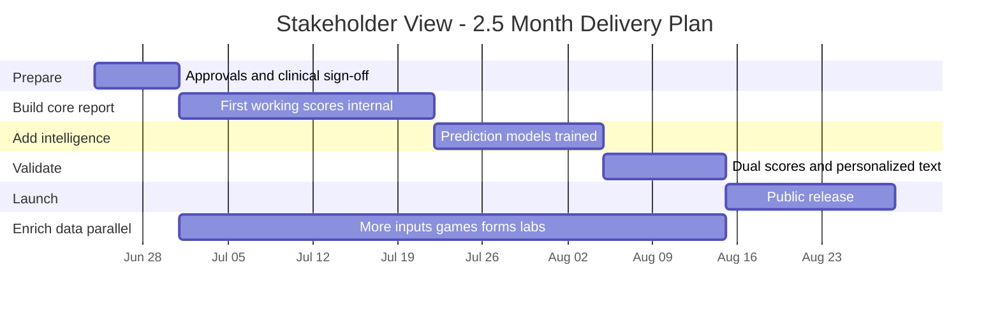

# MindPeers Cognitive Readiness Engine — Stakeholder Roadmap

**Audience:** Product, Clinical, Leadership, Design, Operations  
**Version:** 1.4.0  
**Date:** 2026-06-24  
**Program kickoff:** 24 June 2026  
**Technical companion:** [Development-Roadmap.md](./Development-Roadmap.md) · [Engine-Part1-Full-Stack-Development-Roadmap.md](./Engine-Part1-Full-Stack-Development-Roadmap.md) (backend + frontend + engine — **complete Part1**)

---

## Complete Part1 (backend + frontend + engine)

If you need **everything** — all screens, app APIs, mobile/web UI, and the scoring engine:

| Stack | What | Team |
|-------|------|--------------------------|
| **Data & scoring engine** | Ingestion, ML, CRS, report API | 2 engineers 1 AI/ML Engineer |
| **Platform backend** | Check-in, forms, games, therapy, event gateway | 2 engineers |
| **Frontend** | Mobile + web — all Part1 screens + report dashboard | 2 engineers |
| **Design + QA** | Figma, E2E tests | 2-3 people |
| **Total** | **Complete Part1** | **~6-7 people** |

| Deadline | Feasible? |
|----------|-----------|
| **2 months** | **Yes** — Engine Part 1 |


---

## 2-month program (all phases)

**Kickoff:** 24 June 2026

If leadership requires **full launch + all 70 data inputs in ~2.5 months**:

| Item | Requirement |
|------|-------------|
| **Team** | **4 engineers** (6 h/day, 5 days/week) |
| **Week 8 (~15 Aug)** | Public launch with core inputs (~26%) |
| **Week 8–10** | **100% Part1 inputs** live (parallel enrichment) |
| **Key condition** | Phase 5 expansion runs **in parallel from week 2** (1 July) — not after launch |

---

## Resource distribution

**Working assumption:** Each engineer works **6 hours/day**, **5 days/week** (= **30 hours/week**).

---

### 2-months plan (4 engineers)

Two squads run **at the same time** from week 3:

#### Core squad (3-4 people) — builds launch path

| Role | Count | Responsibility | Weeks active |
|------|-------|----------------|--------------|
| **Engineering lead** | 1 | Program integration, launch, scoring orchestration | 1–9 |
| **Backend engineer** | 2 | Scores, report API, five questions, warnings | 1–9 |
| **Data engineer (platform)** | 1 | Core data pipes, daily rollups, feature pipeline | 1–9 |
| **ML engineer** | 1 | Outcome labels, 4 prediction models, final model update (week 5) | 5–9 |
| **DevOps** | 0.5–1 | Infrastructure, batch jobs, production monitoring | 9 |

#### Expansion squad (3–4 people) — connects remaining inputs in parallel

| Role | Count | Responsibility | Weeks active |
|------|-------|----------------|--------------|
| **Data engineer (inputs A + C)** | 1 | Lifestyle check-ins, brain games, extra assessments, Intake forms, lab results, therapist matching sheet  | 3–8 |
| **Backend / NLP engineer** | 2 | Journal sentiment, app behaviour signals | 3-8 |
| **QA / data analyst** (recommended) | 1 | Score checks, regression tests, sign-off evidence | 8-9 |

---

### Non-engineering resources

These roles are **not** counted in engineering headcount but are **required** for gates:

| Role | Typical commitment | Critical weeks |
|------|-------------------|--------------|
| **Clinical lead** | 4–8 h/week | 1, 4, 8 (sign-offs) |
| **Product manager** | 6–10 h/week | 1, 4, 8 (copy, launch) |
| **Design** | 4–8 h/week | 9–11 (report UI consuming API) |
| **Mobile / app team** | Separate squad | Must emit new event types per Phase 5 schedule |
| **Operations / support** | Ramp at launch | 10+ (runbooks, “why did my score change?”) |

---

### Hiring / allocation checklist (4-month plan)

- [ ] **3 engineers committed full program** (not 50% shared with other products)
- [ ] **1 ML+data engineer** minimum on expansion squad from week 3. Intern can be utilized.
- [ ] **1 ML+data engineer** dedicated from week 1 (ramp) / week 5 (full labels). Intern can be unitilized.
- [ ] **App team** aligned to ship lifestyle, forms, and game events by weeks 5–8
- [ ] **Clinical gates** booked in advance (weeks 1, 4, 8)
- [ ] **Float buffer:** hold 1 engineer unallocated weeks 5–8 for slip recovery (ideal)


---

## In one sentence

We are building a **daily mental-health readiness report** that tells each user **where they are today**, **where they are heading**, and **what to do next** — grounded in their real app activity, assessments, sleep, and therapy data.

---

## What the user will see

When complete, the MindPeers report answers five questions:

| Question | What it means for the user |
|----------|---------------------------|
| **Where am I now?** | Overall readiness score + four dimension scores (Clarity, Emotional Balance, Resilience, Capacity) |
| **Where am I heading?** | Seven trend arrows (e.g. sleep improving, motivation declining) |
| **Why is it like this?** | Plain-language explanation of what’s driving the scores |
| **What should I be aware of?** | Early warnings (e.g. “motivation has dropped this week”) |
| **What should I do next?** | Suggested actions (check-in, sleep tips, contact therapist) |

### The dashboard (simplified)

```
┌─────────────────────────────────────────────────────────────┐
│  TODAY (How you are now)      │  DIRECTION (Where you're    │
│                               │  heading)                   │
├───────────────────────────────┼─────────────────────────────┤
│  Readiness Score ....... 81   │  Recovery .............. ↑  │
│  Clarity ............... 78   │  Stress ................ ↓  │
│  Emotional Balance ..... 72   │  Sleep regularity ...... ↑  │
│  Resilience ............ 80   │  Energy ................ →  │
│  Capacity .............. 74   │  Emotional stability ... ↑  │
│                               │  Motivation ............ ↓  │
│                               │  Mental sharpness ...... ↑  │
└───────────────────────────────┴─────────────────────────────┘
```

Scores update **once per day** (overnight). The app reads the latest report — it does not recalculate on every screen tap.

---

## Two readiness scores (important to understand)

We use **two complementary scores** during rollout. They answer slightly different questions.

| Score | Plain meaning | When it’s the headline |
|-------|---------------|------------------------|
| **Same-day readiness** | “Based on what we know about you *right now*” — built from assessments, check-ins, sleep, engagement | New users; users with limited data; always available as backup |
| **Trajectory readiness (CRS v2)** | “Based on patterns that predict recovery, dropout, and relapse” — uses prediction models | Main headline for established users after launch |

**During weeks 9–10** we show both internally to validate they make sense together. **After launch**, trajectory readiness becomes the main number for most users; same-day readiness stays visible for transparency.

---

## Safety first

| Rule | What it means |
|------|----------------|
| **Risk cap** | If clinical risk indicators are high (CORE-OM risk), **all displayed scores are capped** and the report switches to supportive escalation messaging |
| **No diagnosis** | Copy uses probabilistic language (“may”, “suggests”) — never “you have depression” |
| **Human escalation** | High-risk users are directed toward therapist / support — not only an in-app score |

Clinical team signs off on risk thresholds before we go live.

---

## Clinical team sign-off checklist

Use this checklist at each gate. **Signatory:** Clinical lead (or delegate). **Reference:** [CRS Unified v3 §4.3 & Appendix B.1](../CRS-Calculation-and-Trends-Production-Spec-Unified-v3.md#appendix-b1--clinical-label-decision-tree-for-sign-off).

### How to use

| Gate | Target week | Dates (2026) | Outcome |
|------|-------------|--------------|---------|
| **G1 — Pre-build** | 1 | 24–30 Jun | Build may start |
| **G2 — Risk cap QA** | 4 | ~21 Jul | Staging scores approved |
| **G3 — ML labels** | 6 | ~4 Aug | Models may train |
| **G4 — Narrative & shadow** | 7 | 5–14 Aug | Report copy approved |
| **G5 — Launch** | 8 | from 15 Aug | Production go-live |
| **G6 — Full inputs** | 8–10 | Jul–Aug | 70/70 attribute MCID sign-off |

---

### Clinical sign-off — attributes, MCID & values

**Signatory:** Clinical lead · **Label version:** `label_v2.0.0` · **Reference:** [CRS Unified v3 §4.3.3](../CRS-Calculation-and-Trends-Production-Spec-Unified-v3.md#433-configuration-constants-clinical-sign-off-required), [Appendix B.1](../CRS-Calculation-and-Trends-Production-Spec-Unified-v3.md#appendix-b1--clinical-label-decision-tree-for-sign-off)

Confirm each default **Value** or record an override in the G1 sign-off notes. Attributes marked **N/A** are scoring inputs only (no outcome-label MCID in v2.0.0).

| Attribute | MCID | Value |
|-----------|------|-------|
| **A01** CORE-OM overall score | `CORE_OM_MCID_TOTAL` | **5** raw points (R1 improvement / L1 worsening) |
| **A02** CORE-OM life functioning | `CORE_OM_MCID_SUBSCALE_NORM` | **0.10** normalized (R4 / functioning improvement ≥ +0.10) |
| **A03** CORE-OM problems | `CORE_OM_MCID_SUBSCALE_NORM` | **0.10** normalized (R2 / L2 — problems ↓ = improvement) |
| **A04** CORE-OM wellbeing | `CORE_OM_MCID_SUBSCALE_NORM` | **0.10** normalized (R3 — wellbeing ↑ = improvement) |
| **A05** CORE-OM risk | `CORE_OM_RISK_RELAPSE_THRESHOLD` | **≥ 0.70** normalized (L3 relapse, recovery guard, risk cap trigger) |
| **A05** CORE-OM risk *(display cap)* | `RISK_CAP_CEILING` | **40** (max displayed score when risk ≥ 0.70) |
| **A05** CORE-OM risk *(delta)* | Risk increase (L4) | **≥ +0.15** normalized change |
| **A06** CORE-OM 30-day delta | `CORE_OM_MCID_TOTAL` | **5** raw points (meaningful 30d total change) |
| **A06** CORE-OM 30-day delta *(window)* | Assessment follow-up window | **T+21d to T+45d** (target T+30d) |
| **A07** GAD-7 anxiety | `GAD7_MCID` | **4** raw points (secondary recovery confirmer / L5) |
| **A08** PHQ-9 depression | N/A | Not in `label_v2.0.0` — pillar input only; confirm instrument |
| **A09** Trauma (PTSD) score | N/A | Not in `label_v2.0.0` — pillar input only; confirm instrument |
| **A10** ADHD (ASRS) | N/A | Not in `label_v2.0.0` — pillar input only; confirm instrument |
| **A11** Sleep | Trend direction delta | **3** points (7-day arrow threshold) |
| **A12** Fatigue | N/A | Scoring input only — no label MCID |
| **A13** HRV | Trend direction delta | **3** points (7-day arrow threshold) |
| **A14** Pulse / resting HR | N/A | Scoring input only — no label MCID |
| **A15** Exercise | N/A | Scoring input only — no label MCID |
| **A16** Nutrition | N/A | Scoring input only — no label MCID |
| **A17** Hydration | N/A | Scoring input only — no label MCID |
| **A18** Hunger | N/A | Scoring input only — no label MCID |
| **A19** Sun exposure | N/A | Scoring input only — no label MCID |
| **A20** Libido | N/A | Scoring input only — no label MCID |
| **A21** Cortisol | N/A | Lab reference ranges — no label MCID; consent required |
| **A22** Thyroid (TSH) | N/A | Lab reference ranges — no label MCID; consent required |
| **A23** Blood sugar (glucose) | N/A | Lab reference ranges — no label MCID; consent required |
| **A24** Vitamin D | N/A | Lab reference ranges — no label MCID; consent required |
| **A25** HbA1c | N/A | Lab reference ranges — no label MCID; consent required |
| **A26** Weight change (90d) | N/A | Scoring input only — no label MCID |
| **A27** Mood check-in | Trend direction delta | **3** points; `mood_slope_7d` used in GAD-7 confirmer path |
| **A28** Motivation check-in | Trend direction delta | **3** points (7-day arrow threshold) |
| **A29** Confidence check-in | Trend direction delta | **3** points (7-day arrow threshold) |
| **A30** Memory game | N/A | Scoring input only — no label MCID |
| **A31** Connect Four | N/A | Scoring input only — no label MCID |
| **A32** Whack-a-Mole | N/A | Scoring input only — no label MCID |
| **A33** Journal tone / themes | N/A | NLP pattern input — no label MCID |
| **A34** Blank slate journal | N/A | NLP pattern input — no label MCID |
| **A35** Letter to self journal | N/A | NLP pattern input — no label MCID |
| **A36** Gratitude journal | N/A | NLP pattern input — no label MCID |
| **A37** App engagement | `ENGAGEMENT_LOSS_RELATIVE_DROP` | **50%** relative drop vs 30d baseline → `engagement_loss_label` |
| **A38** Support-seeking frequency | N/A | Scoring input only — no label MCID |
| **A39** Guides / content usage | N/A | Scoring input only — no label MCID |
| **A40** Focus app behaviour | N/A | Scoring input only — no label MCID |
| **A41** Task completion / drop-off | `ENGAGEMENT_LOSS_RELATIVE_DROP` | **50%** (via engagement proxy) |
| **A42** Check-in drop-off | `ENGAGEMENT_LOSS_RELATIVE_DROP` | **50%** (via engagement proxy) |
| **A43** Therapy attendance | N/A | Scoring input only — no label MCID |
| **A44** Therapy intent (form) | N/A | Scoring input only — no label MCID |
| **A45** Primary concern (form) | N/A | Scoring input only — no label MCID |
| **A46** Free-text concern (form NLP) | N/A | Scoring input only — no label MCID |
| **A47** Work-stress pattern (form) | N/A | Scoring input only — no label MCID |
| **A48** Routine disruption (form) | N/A | Scoring input only — no label MCID |
| **A49** Check-in burden (form) | N/A | Scoring input only — no label MCID |
| **A50** Overthinking (form) | N/A | Scoring input only — no label MCID |
| **A51** Decision fatigue (form) | N/A | Scoring input only — no label MCID |
| **A52** Brain fog (form) | N/A | Scoring input only — no label MCID |
| **A53** Work pressure (form) | N/A | Scoring input only — no label MCID |
| **A54** Emotional triggers (form) | N/A | Scoring input only — no label MCID |
| **A55** Relationship stress (form) | N/A | Scoring input only — no label MCID |
| **A56** Self-talk themes (form / journal) | N/A | NLP pattern input — no label MCID |
| **A57** Crisis / risk markers (form) | Escalation trigger | **flag = true** → mandatory human support (not score-only) |
| **A58** Pattern improvement (form) | N/A | Scoring input only — no label MCID |
| **A59** Coping behaviour (form) | N/A | Scoring input only — no label MCID |
| **A60** Trigger reduction (form) | N/A | Scoring input only — no label MCID |
| **A61** Burnout patterns (form) | N/A | Scoring input only — no label MCID |
| **A62** Work functioning (form) | N/A | Scoring input only — no label MCID |
| **A63** Routine difficulty (form) | N/A | Scoring input only — no label MCID |
| **A64** Self-reported overwhelm (form) | N/A | Scoring input only — no label MCID |
| **A65** Missed check-ins (forms rollup) | `DROPOUT_INACTIVE_DAYS` | **30** consecutive inactive days (dropout signal context) |
| **A66** Sessions missed / cancelled | `DROPOUT_INACTIVE_DAYS` | **30** days no session + no app activity (dropout context) |
| **A67** Days since last session | N/A | Scoring input only — no label MCID |
| **A68** Therapist availability | N/A | Scoring input only — no label MCID |
| **A69** Affordability / fee continuity | N/A | Scoring input only — no label MCID |
| **A70** Mode / language match | N/A | Scoring input only — no label MCID |

**Program-level constants (sign once at G1 — apply across attributes)**

| Attribute scope | MCID | Value |
|-----------------|------|-------|
| All CORE-OM label rules | `ASSESSMENT_HORIZON_DAYS` | **30** days (target follow-up) |
| All CORE-OM label rules | `ASSESSMENT_WINDOW_MIN_DAYS` / `MAX` | **21** / **45** days |
| Dropout model | `DROPOUT_HORIZON_DAYS` | **60** days from snapshot T |
| Dropout model | `DROPOUT_INACTIVE_DAYS` | **30** consecutive days |
| Engagement loss model | `ENGAGEMENT_LOSS_RELATIVE_DROP` | **0.50** (50% relative drop) |
| All display scores | Direction rule | Lower CORE-OM total = improvement |

**G1 MCID sign-off**

| Field | Value |
|-------|-------|
| Clinical lead | _________________________ |
| Date | _________________________ |
| Overrides (attribute → new value) | _________________________ |

---

### G1 — Pre-build (Week 1: 24–30 June 2026)

**Thresholds & rules** — full per-attribute table: [Clinical sign-off — attributes, MCID & values](#clinical-sign-off--attributes-mcid--values)

- [ ] **CORE-OM risk cap** — `core_om_risk ≥ 0.70` caps all display scores at **40** (confirm or change threshold)
- [ ] **Risk relapse threshold** — normalized risk **≥ 0.70** at follow-up counts as relapse signal (L3)
- [ ] **CORE-OM total MCID** — default **5 raw points** for meaningful improvement/worsening (R1, L1)
- [ ] **CORE-OM subscale MCID** — default **0.10** normalized for problems / wellbeing / functioning (R2–R4, L2)
- [ ] **GAD-7 MCID** — default **4 raw points** for secondary recovery path and relapse (R4 confirmer, L5)
- [ ] **Assessment follow-up window** — **[T+21d, T+45d]** around 30-day horizon (confirm cadence with product)
- [ ] **Direction rule** — lower CORE-OM total = improvement; documented for ML and reporting teams

**Safety & governance**

- [ ] **Escalation workflow** — who is contacted when risk is elevated; response SLA agreed with operations
- [ ] **No diagnosis rule** — all user-facing copy uses probabilistic language only (“may”, “suggests”); no diagnostic labels
- [ ] **Scores are not therapy** — disclaimer that CRS/readiness is supportive information, not a clinical decision
- [ ] **Crisis pathway** — `form_crisis_marker` and high `core_om_risk` routes to human support (not in-app only)

**Instruments & data**

- [ ] **CORE-OM** — approved for ingestion, subscales used (wellbeing, problems, functioning, risk)
- [ ] **GAD-7** — approved as anxiety input and label confirmer
- [ ] **PHQ-9, PTSD, ASRS** — approved for Phase 5 / enrichment wave (if in 2.5-month scope)
- [ ] **Biomarker consent** — policy for lab results before Wave D (if in scope)

**Sign-off G1**

| Field | Value |
|-------|-------|
| Clinical lead | _________________________ |
| Date | _________________________ |
| Notes / threshold changes | _________________________ |

---

### G2 — Risk cap QA (Week 4: ~21 July 2026)

**Staging verification**

- [ ] Test user with `core_om_risk = 0.72` → **all** pillar, CRS, and trend display scores **≤ 40**
- [ ] Risk-elevated user sees **escalation messaging**, not positive “high readiness” copy
- [ ] `risk_elevated = true` in API when threshold met
- [ ] Risk cap applies to **both** same-day readiness and trajectory readiness (when live)
- [ ] Web-only user (no wearable) — scores still compute; no false risk signals from missing data
- [ ] Cold-start user — cohort prior behaviour acceptable; confidence tier shows “Limited” where appropriate

**Sign-off G2**

| Field | Value |
|-------|-------|
| Clinical lead | _________________________ |
| Date | _________________________ |

---

### G3 — ML outcome labels (Week 6: ~4 August 2026)

**Label definitions (training only — not shown to users)**

- [ ] **Recovery rules R1–R4** reviewed — subscale-aware, not total-score only ([Appendix B.1](../CRS-Calculation-and-Trends-Production-Spec-Unified-v3.md#appendix-b1--clinical-label-decision-tree-for-sign-off))
- [ ] **Relapse rules L1–L5** reviewed — relapse evaluated **before** recovery; mutually exclusive
- [ ] **Recovery safety guard** — no recovery label if `core_om_risk ≥ 0.70` at follow-up
- [ ] **Censoring policy** — no follow-up assessment → label = null (not 0); acceptable training exclusion
- [ ] **GAD-7 secondary path** — acceptable when CORE-OM follow-up missing; flagged `label_confidence=secondary`
- [ ] **Dropout label** — `user_churned` + **30-day** inactivity within **60-day** horizon
- [ ] **Engagement loss** — **≥50%** drop vs 30-day baseline engagement
- [ ] **Censoring rate** — reviewed monthly target **< 40%** for clinical models at 30d+ maturity
- [ ] **`label_version`** — `label_v2.0.0` recorded in model registry with signed thresholds

**Sign-off G3**

| Field | Value |
|-------|-------|
| Clinical lead | _________________________ |
| Date | _________________________ |

---

### G4 — Narrative & shadow report (Week 7: 5–14 August 2026)

**Five report questions (staging)**

- [ ] **Where am I now?** — accurate, non-diagnostic, reflects band (Low / Moderate / High)
- [ ] **Why is it like this?** — drivers use probabilistic language; no invented causes
- [ ] **What should I be aware of?** — trend warnings appropriate severity (info / warning / critical)
- [ ] **What is my risk?** — `relapse_probability` and `core_om_risk` explained without alarmism
- [ ] **What should I do next?** — actions safe and appropriate (check-in, sleep, contact therapist)

**Risk-elevated narrative override**

- [ ] When `core_om_risk ≥ 0.70`, narrative switches to **escalation copy** (not standard positive framing)
- [ ] `escalation_recommended = true` when policy requires human follow-up
- [ ] **Contact therapist / support** is priority action when risk elevated

**Dual scores (shadow period)**

- [ ] Same-day readiness vs trajectory readiness — clinical team comfortable with both being visible internally
- [ ] Large divergence (|v2 − readiness| > 20) — review process defined for outlier users

**Sign-off G4**

| Field | Value |
|-------|-------|
| Clinical lead | _________________________ |
| Product (copy) | _________________________ |
| Date | _________________________ |

---

### G5 — Production launch (Week 8+: from 15 August 2026)

**Go-live**

- [ ] **Trajectory readiness** as headline for mature users — clinical accepts maturity rules (readiness fallback for new users)
- [ ] **Score meanings** — pillar definitions (Clarity, Emotional Balance, Resilience, Capacity) approved for app
- [ ] **Trend arrows** — direction language (↑ improving / ↓ declining) clinically sensible
- [ ] **Support runbook** — ops can answer “why did my score change?” without clinical ticket for every user
- [ ] **Rollback** — clinical accepts `FORCE_CRS_PRIMARY=readiness` if model issues post-launch
- [ ] **Monitoring** — quarterly clinical review of thresholds scheduled

**Sign-off G5 (go / no-go)**

| Field | Value |
|-------|-------|
| Clinical lead | _________________________ |
| Product | _________________________ |
| Date | _________________________ |
| Decision | ☐ Go  ☐ No-go  ☐ Go with conditions: _______________ |

---

### G6 — New clinical inputs (Weeks 8–10 — enrichment parallel)

*Complete if Phase 5 waves ship in 2.5-month plan.*

- [ ] **PHQ-9 (depression)** — scoring and pillar contribution clinically appropriate
- [ ] **Trauma / PTSD instrument** — handling and copy reviewed
- [ ] **ADHD (ASRS)** — Clarity pillar use approved
- [ ] **Intake form crisis markers** (`form_crisis_marker`) — escalation path tested
- [ ] **Biomarker results** — reference ranges and consent; no diagnostic claims from lab values
- [ ] **Journal sentiment** — NLP outputs framed as patterns, not clinical conclusions
- [ ] **70/70 attribute binding** — clinical spot-check: sample users traceable input → score

**Sign-off G6**

| Field | Value |
|-------|-------|
| Clinical lead | _________________________ |
| Date | _________________________ |

---

### Ongoing governance (post-launch)

- [ ] **Quarterly threshold review** — MCID, risk cap, label rates
- [ ] **Label drift alert** — ±5% change in positive label rate investigated with clinical
- [ ] **Model AUC drop** — >5% weekly decline triggers clinical + ML review
- [ ] **Reassessment cadence** — product nudges align with 21–45 day CORE-OM window

---

## Timeline overview

**Program kickoff:** **24 June 2026** (Week 1)  
**Target:** ~2.5 months to public launch (~early September 2026)

| Week | Dates (2026) | Phase |
|------|----------------|-------|
| 1 | 24 Jun – 30 Jun | Prepare — approvals & clinical sign-off |
| 2–4 | 1 Jul – 21 Jul | Build core report — first scores |
| 5–6 | 22 Jul – 4 Aug | Prediction models |
| 7 | 5 Aug – 14 Aug | Validate — dual scores + narrative |
| 8+ | 15 Aug onward | Public release |
| 2–8 (parallel) | 1 Jul – 14 Aug | Enrich data — games, forms, labs |



---

## Phase-by-phase — what changes for users and the business

### Phase 0 — Prepare (Week 1 — starts 24 June 2026)

**What happens:** Specs, clinical thresholds, and data agreements are approved.

| You’ll see | You won’t see yet |
|------------|-------------------|
| Signed-off score meanings and risk rules | Any live user scores |

**We need from you:**

- Clinical: complete **[G1 checklist](#g1--pre-build-week-1-24-30-june-2026)** (risk cap, MCIDs, escalation)  
- Product: approve score labels and band copy (Low / Moderate / High)  

---

### Phase 1 — Foundation (Weeks 2–4 — 1 July to 21 July 2026)

**What happens:** We connect core data sources and produce the **first real scores** using rule-based logic (no AI predictions yet).

**What users get (internal / staging only):**

- Overall **same-day readiness** score  
- Four pillar scores (Clarity, Emotional Balance, Resilience, Capacity)  
- Seven trend directions  
- Risk cap when clinical risk is elevated  

**Which user data powers this phase (~26% of full product spec):**

| Included now | Coming later (Phase 5) |
|--------------|------------------------|
| CORE-OM & GAD-7 assessments | Depression (PHQ-9), trauma, ADHD screens |
| Mood, motivation, confidence check-ins | Lifestyle (fatigue, exercise, nutrition, hydration) |
| Sleep & heart-rate (wearables) | Lab biomarkers (cortisol, thyroid, glucose, etc.) |
| App engagement | Brain games scores |
| Therapy attendance | Intake forms (21 fields) |
| | Therapist matching sheet |
| | Advanced journal analysis |

> **Important:** Phase 1 delivers the **full scoring framework** but only **about one-quarter of all planned data inputs**. Missing inputs don’t break the report — weights adjust to use what’s available. This is intentional so we can ship a credible report early.

**Business milestone (Week 4 — ~21 July 2026):** First scores visible for test users in staging.

---

### Phase 2 — Prediction models (Weeks 5–6 — 22 July to 4 August 2026)

**What happens:** We train AI models on historical data to predict four real outcomes:

| Outcome | Plain question |
|---------|----------------|
| Recovery | Is the user likely to show meaningful clinical improvement? |
| Relapse | Is the user likely to worsen? |
| Dropout | Is the user likely to leave therapy or go inactive? |
| Engagement loss | Is the user likely to disengage from the app? |

**What users get:** Still the same-day readiness score publicly. Models run in the background — not yet the headline number.

**We need from you:**

- Clinical: review how “recovery” and “relapse” are defined from assessments  
- Leadership: patience — model quality depends on having enough historical follow-up data  

**Business milestone (Week 6 — ~4 August 2026):** Models pass quality checks and are approved for shadow testing.

---

### Phase 3 — Validate before launch (Week 7 — ~5–14 August 2026)

**What happens:** We combine prediction models into the **trajectory readiness score** and add **personalized report text** (the five questions).

**What users get (staging / internal QA):**

- Both scores side by side for comparison  
- “Where / Why / Aware / Risk / Next” narrative blocks  
- Early-warning flags (e.g. declining motivation)  

**We need from you:**

- Product: review all user-facing copy  
- Clinical: review risk and escalation messaging  
- Design: review report layout with real sample data  

**Business milestone (Week 7 — ~14 August 2026):** Go / no-go decision for public launch.

---

### Phase 4 — Public launch (Week 8+ — from ~15 August 2026)

**What happens:** Trajectory readiness becomes the **main headline score** for users with enough history. The report API goes live in production with monitoring and rollback plans.

**What users get:**

- Full daily report in the app  
- Trajectory readiness as primary score (when data maturity is sufficient)  
- Same-day readiness still visible for context  
- Personalized guidance and risk-aware messaging  

**We need from you:**

- Product & Clinical: final sign-off  
- Operations: support runbooks for “why did my score change?”  
- Leadership: communicate two-score story clearly in release notes  

---

### Phase 5 — Richer data (parallel from Week 2 — 1 July 2026)

**What happens:** We connect remaining data sources from the Engine Part1 product spec so scores use **100% of planned inputs**.

| Wave | What we add | User-visible benefit |
|------|-------------|---------------------|
| **A** | Lifestyle check-ins + brain games | Richer energy, recovery, and cognitive trends |
| **B** | Intake / onboarding forms | Better understanding of work stress, burnout, routines |
| **C** | Extra assessments (depression, trauma, ADHD) | More complete clinical picture |
| **D** | Lab results + therapist matching data | Deeper biological and therapy-fit signals |
| **E** | Journal sentiment analysis | Emotional patterns from writing |

**What users get over time:** Scores become **more personalized and stable** as more inputs flow in. Users who only use core features are unaffected.

**Business milestone:** 100% of planned inputs connected; trend arrows use full formula set.

---


## Frequently asked questions

**Q: Will Phase 1 mean Engine Part1 is “done”?**  
**A:** No. Phase 1 means the **report works** with core inputs (assessments, check-ins, sleep, engagement, therapy). The full Part1 input list completes in Phase 5. Formulas are ready from day one; data connections grow over time.

**Q: Can we launch without games, forms, and lab data?**  
**A:** Yes. Launch (Phase 4) is designed around core inputs. Phase 5 improves accuracy and personalization — it does not block launch.

**Q: Why two readiness scores?**  
**A:** Same-day readiness works from day one and is easy to explain. Trajectory readiness is more predictive but needs models and history. We use both during validation, then promote trajectory readiness for established users.

**Q: What if a user has no wearable?**  
**A:** The report still works. Sleep and heart-rate sections adjust; scores use check-ins, assessments, and app activity instead.

**Q: What if scores look wrong?**  
**A:** Every score is traceable to source data and versioned formulas. We can audit “why” for any user. Rollback switches are available if a model misbehaves after launch.

**Q: How often do scores update?**  
**A:** Once daily, typically ready by early morning UTC. Yesterday’s activity is included in today’s report.

**Q: Who owns clinical safety?**  
**A:** Clinical lead completes the [Clinical team sign-off checklist](#clinical-team-sign-off-checklist) at each gate (G1–G6). Engineering implements — Clinical governs.

---

## Your involvement — quick reference

| Role | Phase 0 | Phase 1 | Phase 2 | Phase 3 | Phase 4 | Phase 5 |
|------|---------|---------|---------|---------|---------|---------|
| **Clinical** | **[G1](#g1--pre-build-week-1-24-30-june-2026)** thresholds | **[G2](#g2--risk-cap-qa-week-4-21-july-2026)** risk cap QA | **[G3](#g3--ml-outcome-labels-week-6-4-august-2026)** labels | **[G4](#g4--narrative--shadow-report-week-7-5-14-august-2026)** narrative | **[G5](#g5--production-launch-week-8-from-15-august-2026)** launch | **[G6](#g6--new-clinical-inputs-weeks-8-10--enrichment-parallel)** new inputs |
| **Product** | Score meanings | Staging review | — | Copy + UX QA | Launch comms | Prioritize waves |
| **Design** | — | Early layouts | — | Report polish | Production UI handoff | New input UX |
| **Leadership** | Scope approval | — | — | Go/no-go | Launch | Investment for Phase 5 |
| **Operations** | — | — | — | — | Support runbooks | New source monitoring |

---

## Risks stakeholders should know

| Risk | Impact | Our mitigation |
|------|--------|----------------|
| Users expect “full Part1” at Week 4 | Disappointment / trust | This document + clear “26% inputs” messaging |
| Sparse reassessment data | Weaker predictions early | Models improve as cohort matures; censoring rules prevent false confidence |
| Two scores confuse users | Support burden | Footnotes in app; readiness stays visible after launch |
| New data sources delayed | Slower Phase 5 | Launch unaffected; scores renormalize with available data |

---

## Glossary (minimal)

| Term | Plain meaning |
|------|----------------|
| **Readiness score** | 0–100 summary of mental readiness |
| **Pillar** | One of four “how you are now” dimensions |
| **Trend** | A direction arrow showing improvement or decline over ~7 days |
| **Risk cap** | Safety rule that limits scores when clinical risk is high |
| **Staging** | Internal test environment — not visible to real users |
| **GA** | General availability — live for real users |

---
