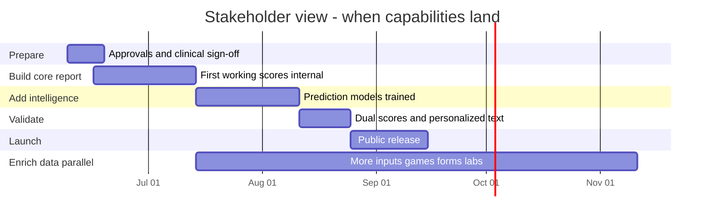

# MindPeers Cognitive Readiness Engine — Stakeholder Roadmap

**Audience:** Product, Clinical, Leadership, Design, Operations  
**Version:** 1.2.0  
**Date:** 2026-06-05  
**Technical companion:** [Development-Roadmap.md](./Development-Roadmap.md) · [Development-Roadmap-4Month-Accelerated.md](./Development-Roadmap-4Month-Accelerated.md) (engine only) · **[Engine-Part1-Full-Stack-Development-Roadmap.md](./Engine-Part1-Full-Stack-Development-Roadmap.md)** (backend + frontend + engine — **complete Part1**)

---

## Complete Part1 (backend + frontend + engine)

If you need **everything** — all screens, app APIs, mobile/web UI, and the scoring engine:

| Stack | What | Team (6-month realistic) |
|-------|------|--------------------------|
| **Data & scoring engine** | Ingestion, ML, CRS, report API | 6–7 engineers |
| **Platform backend** | Check-in, forms, games, therapy, event gateway | 3 engineers |
| **Frontend** | Mobile + web — all 12 Part1 screens + report dashboard | 4–5 engineers |
| **Design + QA** | Figma, E2E tests | 3–4 people |
| **Total** | **Complete Part1** | **~16–19 people** |

| Deadline | Feasible? |
|----------|-----------|
| **6 months** | **Yes** — recommended plan |
| **4 months everything** | Only with **~20 people** or reduced scope |
| **4 months** | Engine + **Report UI only** (~12 people); remaining screens months 5–7 |

Full screen catalog, workstreams, hours, and definition of done: **[Engine-Part1-Full-Stack-Development-Roadmap.md](./Engine-Part1-Full-Stack-Development-Roadmap.md)**

---

## 4-month program (all phases)

If leadership requires **full launch + all 70 data inputs in 4 months**:

| Item | Requirement |
|------|-------------|
| **Team** | **8–9 engineers** (6 h/day, 5 days/week) |
| **Week 10** | Public launch with core inputs (~26%) |
| **Week 17** | **100% Part1 inputs** live |
| **Key condition** | Phase 5 expansion runs **in parallel from week 3** — not after launch |

Full week-by-week plan, squad structure, and risks: **[Development-Roadmap-4Month-Accelerated.md](./Development-Roadmap-4Month-Accelerated.md)**

---

## Resource distribution

**Working assumption:** Each engineer works **6 hours/day**, **5 days/week** (= **30 hours/week**).

### Two delivery options at a glance

| | **Standard plan** | **4-month plan (all phases)** |
|--|-------------------|-------------------------------|
| **Goal** | Launch in ~3 months; full data inputs over 6–8 months | Launch week 10 + **100% inputs by week 17** |
| **Engineering headcount** | **4–5** | **8–9** |
| **Total engineering hours** | ~1,000 (to launch) + ~800 (Phase 5) | ~4,000 (everything) |
| **Risk** | Moderate | High — needs parallel teams from week 3 |
| **Best when** | Budget-conscious; enrich after launch | Fixed 4-month deadline; leadership committed to staffing |

---

### Option A — Standard plan (4–5 engineers)

| Role | Count | What they do (plain language) | Busiest weeks |
|------|-------|------------------------------|---------------|
| **Engineering lead** | 1 | Owns end-to-end delivery, scoring logic, launch cutover | 1–13 |
| **Backend engineer** | 1 | Builds scores, daily report API, personalized text | 1–13 |
| **Data engineer** | 1 | Connects app/wearable/therapy data; prepares inputs for scoring | 1–8, then 50% on Phase 5 |
| **ML engineer** | 1 | Trains prediction models; runs nightly probability updates | 5–13 |
| **DevOps** (part-time) | 0.5 | Servers, batch schedules, monitoring, API reliability | 1–4 setup; 11–13 launch |

**Phase 5 add-on (months 4–8):** +1 data engineer for forms, lifestyle, games, labs (or extend data engineer to full-time).

```
Month 1          Month 2          Month 3          Month 4+
[Data][Backend]  [Data][ML]       [ML][Backend]    [+1 Data for
[Lead][DevOps]   [Lead][Backend]  [Lead][DevOps]    enrichment]
     Phase 1          Phase 2          Phase 3–4         Phase 5
```

---

### Option B — 4-month plan (8–9 engineers) — recommended for your deadline

Two squads run **at the same time** from week 3:

#### Core squad (5 people) — builds launch path

| Role | Count | Responsibility | Weeks active |
|------|-------|----------------|--------------|
| **Engineering lead** | 1 | Program integration, launch, scoring orchestration | 1–17 |
| **Backend engineer** | 1 | Scores, report API, five questions, warnings | 1–17 |
| **Data engineer (platform)** | 1 | Core data pipes, daily rollups, feature pipeline | 1–17 |
| **ML engineer** | 1 | Outcome labels, 4 prediction models, final model update (week 16) | 5–17 (ramp-up weeks 1–4) |
| **DevOps** | 0.5–1 | Infrastructure, batch jobs, production monitoring | 1–17 |

#### Expansion squad (3–4 people) — connects remaining inputs in parallel

| Role | Count | Responsibility | Weeks active |
|------|-------|----------------|--------------|
| **Data engineer (inputs A + C)** | 1 | Lifestyle check-ins, brain games, extra assessments | 3–14 |
| **Data engineer (inputs B + D)** | 1 | Intake forms, lab results, therapist matching sheet | 5–14 |
| **Backend / NLP engineer** | 1 | Journal sentiment, app behaviour signals | 5–12 |
| **QA / data analyst** (recommended) | 1 | Score checks, regression tests, sign-off evidence | 4–17 |

```
Week:  1   2   3   4   5   6   7   8   9  10  11  12  13  14  15  16  17
       |------- Core squad (5) --------------------------------------------|
       |           |---- Expansion squad (3-4) ---------------------------|
       |           |    Wave A (lifestyle, games)                          |
       |               |    Wave B (forms)                                  |
       |                   |    Wave C (assessments)                       |
       |                       |    Wave D (labs, therapist)               |
       |           |    Wave E (journal NLP) ------------------------------|
       |                               | GA week 10                        |
       |                                                   | 70/70 week 17 |
```

---

### Engineering hours by phase (4-month plan)

| Phase | Calendar weeks | Est. hours | Primary owners |
|-------|----------------|------------|----------------|
| Prepare + Foundation | 1–4 | ~550 | Lead, data platform, backend |
| Prediction models | 5–8 | ~500 | ML, data platform |
| Validate + launch | 9–10 | ~280 | Backend, lead, ML |
| Production hardening | 11–12 | ~200 | Backend, DevOps |
| Full input expansion | 3–16 (parallel) | ~1,800 | Expansion squad (3–4) |
| Final integration + model update | 13–17 | ~400 | All squads |
| **Total** | **17** | **~3,800–4,200** | **8–9 engineers** |

**Capacity check:** 8 engineers × 17 weeks × 30 h = **4,080 hours** — fits with **little slack**; 9th person (QA) strongly recommended.

---

### Resource ramp by month (4-month plan)

| Month | Engineers (FTE) | Focus |
|-------|-------------------|--------|
| **Month 1** | 6 (core 5 + 1 expansion starts week 3) | Core data + first scores; expansion schemas |
| **Month 2** | 8 | Models + forms + lifestyle + games |
| **Month 3** | 8–9 | Launch + labs + journal NLP |
| **Month 4** | 8–9 | Integrate all 70 inputs; final QA + model refresh |

*FTE = full-time equivalent at 30 h/week.*

---

### Non-engineering resources (both plans)

These roles are **not** counted in engineering headcount but are **required** for gates:

| Role | Typical commitment | Critical weeks |
|------|-------------------|--------------|
| **Clinical lead** | 4–8 h/week | 1, 8, 10, 17 (sign-offs) |
| **Product manager** | 6–10 h/week | 1, 9–10, 17 (copy, launch) |
| **Design** | 4–8 h/week | 9–11 (report UI consuming API) |
| **Mobile / app team** | Separate squad | Must emit new event types per Phase 5 schedule |
| **Operations / support** | Ramp at launch | 10+ (runbooks, “why did my score change?”) |

---

### Budget summary for leadership

| Plan | Engineers | Duration | Eng hours | Approx. person-months* |
|------|-----------|----------|-----------|------------------------|
| Standard (launch only) | 4–5 | 3 months | ~1,000 | **3–4** |
| Standard (launch + Phase 5) | 5–6 | 8 months | ~1,800 | **7–8** |
| **4-month all phases** | **8–9** | **4 months** | **~4,000** | **13–14** |

\*Person-months = engineering hours ÷ 120 h (30 h/week × 4 weeks). Use your internal day rate × person-months for budget.

---

### Hiring / allocation checklist (4-month plan)

- [ ] **8 engineers committed full program** (not 50% shared with other products)
- [ ] **2 data engineers** minimum on expansion squad from week 3
- [ ] **1 ML engineer** dedicated from week 1 (ramp) / week 5 (full labels)
- [ ] **App team** aligned to ship lifestyle, forms, and game events by weeks 5–8
- [ ] **Clinical gates** booked in advance (weeks 1, 8, 10, 17)
- [ ] **Float buffer:** hold 1 engineer unallocated weeks 15–17 for slip recovery (ideal)

Technical detail: [Development-Roadmap-4Month-Accelerated.md §2](./Development-Roadmap-4Month-Accelerated.md#2-team-structure-required)

---

## In one sentence

We are building a **daily mental-health readiness report** that tells each user **where they are today**, **where they are heading**, and **what to do next** — grounded in their real app activity, assessments, sleep, and therapy data.

---

## What the user will see

When complete, the MindPeers report answers five questions:

| Question | What it means for the user |
|----------|---------------------------|
| **Where am I now?** | Overall readiness score + four dimension scores (Clarity, Emotional Balance, Resilience, Capacity) |
| **Where am I heading?** | Seven trend arrows (e.g. sleep improving, motivation declining) |
| **Why is it like this?** | Plain-language explanation of what’s driving the scores |
| **What should I be aware of?** | Early warnings (e.g. “motivation has dropped this week”) |
| **What should I do next?** | Suggested actions (check-in, sleep tips, contact therapist) |

### The dashboard (simplified)

```
┌─────────────────────────────────────────────────────────────┐
│  TODAY (How you are now)      │  DIRECTION (Where you're    │
│                               │  heading)                   │
├───────────────────────────────┼─────────────────────────────┤
│  Readiness Score ....... 81   │  Recovery .............. ↑  │
│  Clarity ............... 78   │  Stress ................ ↓  │
│  Emotional Balance ..... 72   │  Sleep regularity ...... ↑  │
│  Resilience ............ 80   │  Energy ................ →  │
│  Capacity .............. 74   │  Emotional stability ... ↑  │
│                               │  Motivation ............ ↓  │
│                               │  Mental sharpness ...... ↑  │
└───────────────────────────────┴─────────────────────────────┘
```

Scores update **once per day** (overnight). The app reads the latest report — it does not recalculate on every screen tap.

---

## Two readiness scores (important to understand)

We use **two complementary scores** during rollout. They answer slightly different questions.

| Score | Plain meaning | When it’s the headline |
|-------|---------------|------------------------|
| **Same-day readiness** | “Based on what we know about you *right now*” — built from assessments, check-ins, sleep, engagement | New users; users with limited data; always available as backup |
| **Trajectory readiness (CRS v2)** | “Based on patterns that predict recovery, dropout, and relapse” — uses prediction models | Main headline for established users after launch |

**During weeks 9–10** we show both internally to validate they make sense together. **After launch**, trajectory readiness becomes the main number for most users; same-day readiness stays visible for transparency.

---

## Safety first

| Rule | What it means |
|------|----------------|
| **Risk cap** | If clinical risk indicators are high (CORE-OM risk), **all displayed scores are capped** and the report switches to supportive escalation messaging |
| **No diagnosis** | Copy uses probabilistic language (“may”, “suggests”) — never “you have depression” |
| **Human escalation** | High-risk users are directed toward therapist / support — not only an in-app score |

Clinical team signs off on risk thresholds before we go live.

---

## Timeline overview

**Standard plan:** ~11 weeks to public launch, then 4–7 months to connect all data inputs.

**4-month plan:** Launch week **10**, all inputs week **17** — requires **8–9 engineers** (see [Resource distribution](#resource-distribution)).



---

## Phase-by-phase — what changes for users and the business

### Phase 0 — Prepare (1–2 weeks before build)

**What happens:** Specs, clinical thresholds, and data agreements are approved.

| You’ll see | You won’t see yet |
|------------|-------------------|
| Signed-off score meanings and risk rules | Any live user scores |

**We need from you:**

- Clinical: approve risk cap and assessment change rules  
- Product: approve score labels and band copy (Low / Moderate / High)  
- Leadership: confirm launch scope (core report first; full data inputs later)

---

### Phase 1 — Foundation (Weeks 1–4)

**What happens:** We connect core data sources and produce the **first real scores** using rule-based logic (no AI predictions yet).

**What users get (internal / staging only):**

- Overall **same-day readiness** score  
- Four pillar scores (Clarity, Emotional Balance, Resilience, Capacity)  
- Seven trend directions  
- Risk cap when clinical risk is elevated  

**Which user data powers this phase (~26% of full product spec):**

| Included now | Coming later (Phase 5) |
|--------------|------------------------|
| CORE-OM & GAD-7 assessments | Depression (PHQ-9), trauma, ADHD screens |
| Mood, motivation, confidence check-ins | Lifestyle (fatigue, exercise, nutrition, hydration) |
| Sleep & heart-rate (wearables) | Lab biomarkers (cortisol, thyroid, glucose, etc.) |
| App engagement | Brain games scores |
| Therapy attendance | Intake forms (21 fields) |
| | Therapist matching sheet |
| | Advanced journal analysis |

> **Important:** Phase 1 delivers the **full scoring framework** but only **about one-quarter of all planned data inputs**. Missing inputs don’t break the report — weights adjust to use what’s available. This is intentional so we can ship a credible report early.

**Business milestone (Week 4):** First scores visible for test users in staging.

---

### Phase 2 — Prediction models (Weeks 5–8)

**What happens:** We train AI models on historical data to predict four real outcomes:

| Outcome | Plain question |
|---------|----------------|
| Recovery | Is the user likely to show meaningful clinical improvement? |
| Relapse | Is the user likely to worsen? |
| Dropout | Is the user likely to leave therapy or go inactive? |
| Engagement loss | Is the user likely to disengage from the app? |

**What users get:** Still the same-day readiness score publicly. Models run in the background — not yet the headline number.

**We need from you:**

- Clinical: review how “recovery” and “relapse” are defined from assessments  
- Leadership: patience — model quality depends on having enough historical follow-up data  

**Business milestone (Week 8):** Models pass quality checks and are approved for shadow testing.

---

### Phase 3 — Validate before launch (Weeks 9–10)

**What happens:** We combine prediction models into the **trajectory readiness score** and add **personalized report text** (the five questions).

**What users get (staging / internal QA):**

- Both scores side by side for comparison  
- “Where / Why / Aware / Risk / Next” narrative blocks  
- Early-warning flags (e.g. declining motivation)  

**We need from you:**

- Product: review all user-facing copy  
- Clinical: review risk and escalation messaging  
- Design: review report layout with real sample data  

**Business milestone (Week 10):** Go / no-go decision for public launch.

---

### Phase 4 — Public launch (Week 11+)

**What happens:** Trajectory readiness becomes the **main headline score** for users with enough history. The report API goes live in production with monitoring and rollback plans.

**What users get:**

- Full daily report in the app  
- Trajectory readiness as primary score (when data maturity is sufficient)  
- Same-day readiness still visible for context  
- Personalized guidance and risk-aware messaging  

**Launch does not wait** for every data source (games, forms, labs) — those enrich scores in Phase 5.

**We need from you:**

- Product & Clinical: final launch sign-off  
- Operations: support runbooks for “why did my score change?”  
- Leadership: communicate two-score story clearly in release notes  

**Business milestone:** Production launch with 99.9% API availability target.

---

### Phase 5 — Richer data (parallel from Week 5, ~4–7 months)

**What happens:** We connect remaining data sources from the Engine Part1 product spec so scores use **100% of planned inputs**.

| Wave | What we add | User-visible benefit |
|------|-------------|---------------------|
| **A** | Lifestyle check-ins + brain games | Richer energy, recovery, and cognitive trends |
| **B** | Intake / onboarding forms | Better understanding of work stress, burnout, routines |
| **C** | Extra assessments (depression, trauma, ADHD) | More complete clinical picture |
| **D** | Lab results + therapist matching data | Deeper biological and therapy-fit signals |
| **E** | Journal sentiment analysis | Emotional patterns from writing |

**What users get over time:** Scores become **more personalized and stable** as more inputs flow in. Users who only use core features are unaffected.

**Business milestone:** 100% of planned inputs connected; trend arrows use full formula set.

---

## Milestones executives can track

### Standard plan

| # | When | What success looks like | Data richness | Team size |
|---|------|-------------------------|---------------|-----------|
| **M1** | Week 4 | First real scores for test users | ~26% | 4–5 |
| **M2** | Week 8 | Prediction models approved | ~26% | 4–5 |
| **M3** | Week 10 | Personalized report ready for review | ~26% + narrative | 4–5 |
| **M4** | Week 11–13 | **Public launch** | ~26% at launch | 4–5 |
| **M5** | Month 4–5 | Half of all inputs connected | ~50% | 5–6 |
| **M6** | Month 6–8 | All inputs connected | **100%** | 5–6 |

### 4-month plan (all phases)

| # | When | What success looks like | Data richness | Team size |
|---|------|-------------------------|---------------|-----------|
| **M1** | Week 3 | First scores (accelerated) | ~26% | 6 ramping to 8 |
| **M2** | Week 7 | Models approved | ~26% | 8 |
| **M3** | Week 9 | Shadow report ready | ~26% + narrative | 8–9 |
| **M4** | **Week 10** | **Public launch** | ~55% | 8–9 |
| **M5** | Week 12 | Most inputs connected | ~65% | 8–9 |
| **M6** | **Week 17** | **All 70 inputs live** | **100%** | 8–9 |

---

## What we are *not* building in the *engine-only* program

The documents [Development-Roadmap.md](./Development-Roadmap.md) and [Development-Roadmap-4Month-Accelerated.md](./Development-Roadmap-4Month-Accelerated.md) cover **Stack A** (data & scoring engine) only.

For **complete Part1 including mobile/web UI and platform backend**, see **[Engine-Part1-Full-Stack-Development-Roadmap.md](./Engine-Part1-Full-Stack-Development-Roadmap.md)**.

| Out of scope in engine-only docs | Covered in full-stack doc |
|----------------------------------|---------------------------|
| Mobile / web UI implementation | 12 product screens + report dashboard |
| App backend services (check-in, forms, games) | Platform backend workstream |
| Real-time score on every tap | Daily batch (both plans) |
| AI chat / open-ended coaching | Separate LLM program |
| Full CogniArt cognitive testing | Future phase |

---

## Frequently asked questions

**Q: How many engineers do we need?**  
**A:** **4–5** for launch in ~3 months (standard). **8–9** to finish **everything** including all 70 data inputs in **4 months**. See [Resource distribution](#resource-distribution).

**Q: Will Phase 1 mean Engine Part1 is “done”?**  
**A:** No. Phase 1 means the **report works** with core inputs (assessments, check-ins, sleep, engagement, therapy). The full Part1 input list completes in Phase 5. Formulas are ready from day one; data connections grow over time.

**Q: Can we launch without games, forms, and lab data?**  
**A:** Yes. Launch (Phase 4) is designed around core inputs. Phase 5 improves accuracy and personalization — it does not block launch.

**Q: Why two readiness scores?**  
**A:** Same-day readiness works from day one and is easy to explain. Trajectory readiness is more predictive but needs models and history. We use both during validation, then promote trajectory readiness for established users.

**Q: What if a user has no wearable?**  
**A:** The report still works. Sleep and heart-rate sections adjust; scores use check-ins, assessments, and app activity instead.

**Q: What if scores look wrong?**  
**A:** Every score is traceable to source data and versioned formulas. We can audit “why” for any user. Rollback switches are available if a model misbehaves after launch.

**Q: How often do scores update?**  
**A:** Once daily, typically ready by early morning UTC. Yesterday’s activity is included in today’s report.

**Q: Who owns clinical safety?**  
**A:** Clinical lead approves risk thresholds, label definitions, and escalation copy. Engineering implements — Clinical governs.

---

## Your involvement — quick reference

| Role | Phase 0 | Phase 1 | Phase 2 | Phase 3 | Phase 4 | Phase 5 |
|------|---------|---------|---------|---------|---------|---------|
| **Clinical** | Approve risk & labels | Risk cap QA | Label definitions | Narrative + risk copy | Launch sign-off | New input validation |
| **Product** | Score meanings | Staging review | — | Copy + UX QA | Launch comms | Prioritize waves |
| **Design** | — | Early layouts | — | Report polish | Production UI handoff | New input UX |
| **Leadership** | Scope approval | — | — | Go/no-go | Launch | Investment for Phase 5 |
| **Operations** | — | — | — | — | Support runbooks | New source monitoring |

---

## Risks stakeholders should know

| Risk | Impact | Our mitigation |
|------|--------|----------------|
| Users expect “full Part1” at Week 4 | Disappointment / trust | This document + clear “26% inputs” messaging |
| Sparse reassessment data | Weaker predictions early | Models improve as cohort matures; censoring rules prevent false confidence |
| Two scores confuse users | Support burden | Footnotes in app; readiness stays visible after launch |
| New data sources delayed | Slower Phase 5 | Launch unaffected; scores renormalize with available data |

---

## Glossary (minimal)

| Term | Plain meaning |
|------|----------------|
| **Readiness score** | 0–100 summary of mental readiness |
| **Pillar** | One of four “how you are now” dimensions |
| **Trend** | A direction arrow showing improvement or decline over ~7 days |
| **Risk cap** | Safety rule that limits scores when clinical risk is high |
| **Staging** | Internal test environment — not visible to real users |
| **GA** | General availability — live for real users |

---

## Related documents

| Document | Who should read it |
|----------|-------------------|
| [Engine-Part1-Full-Stack-Development-Roadmap.md](./Engine-Part1-Full-Stack-Development-Roadmap.md) | **Complete Part1** — engine + backend + frontend |
| [Development-Roadmap-4Month-Accelerated.md](./Development-Roadmap-4Month-Accelerated.md) | Engineering leads — 4-month engine-only staffing |
| [Development-Roadmap.md](./Development-Roadmap.md) | Engineering, Data, ML — technical schedule |
| [MindPeers-Engine-Master-Production-Spec.md](./MindPeers-Engine-Master-Production-Spec.md) | Deep dive for technical leads |
| [Engine Part1.docx](../Engine%20Part1.docx) | Product source — pillar inputs and weights |
| [00-Master-Program-TRD.md](./00-Master-Program-TRD.md) | Formal requirements |

### Export to PDF

```bash
pandoc final/Development-Roadmap-Stakeholder.md \
  -o final/Development-Roadmap-Stakeholder.pdf \
  --toc -V geometry:margin=1in \
  --metadata title="MindPeers Engine — Stakeholder Roadmap"
```

---

## Revision history

| Version | Date | Changes |
|---------|------|---------|
| 1.1.1 | 2026-06-05 | Link to full-stack Part1 roadmap (backend + frontend + engine) |
| 1.1.0 | 2026-06-05 | Resource distribution section (standard vs 4-month staffing, hours, ramp) |
| 1.0.2 | 2026-06-05 | Link to 4-month accelerated all-phases plan |
| 1.0.1 | 2026-06-05 | Fix Mermaid Gantt syntax for GitHub renderer |
| 1.0.0 | 2026-06-05 | Initial non-technical stakeholder roadmap |

---

*Questions? Contact the program lead. For technical implementation detail, see [Development-Roadmap.md](./Development-Roadmap.md).*
