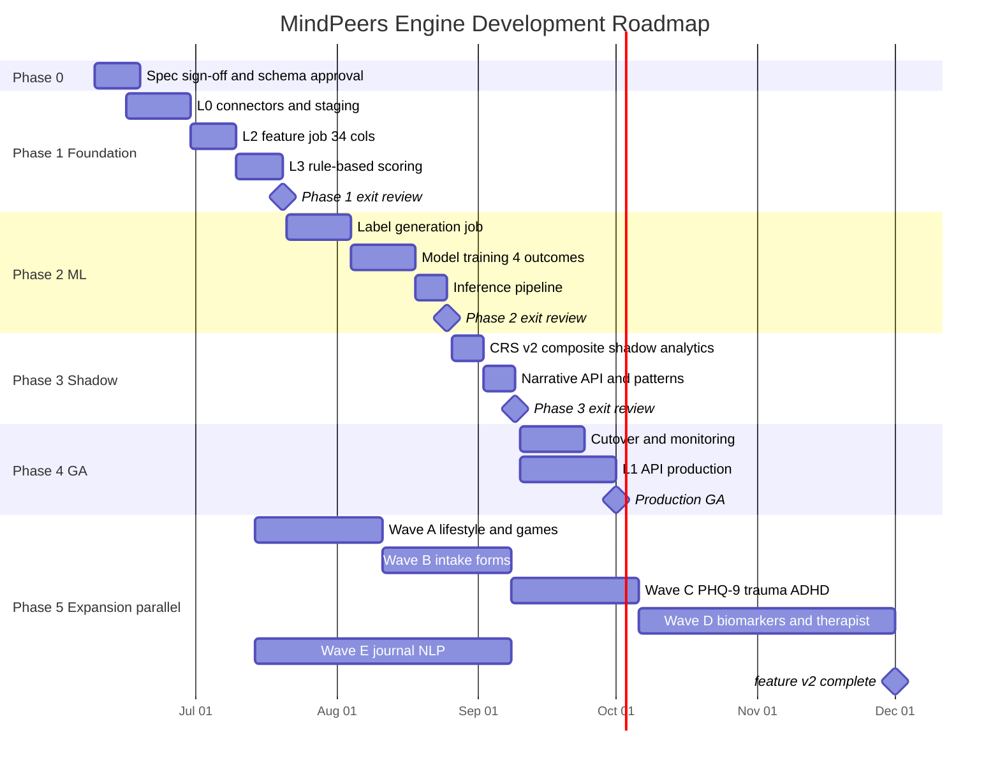
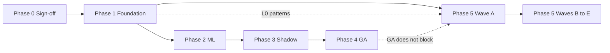

# MindPeers Cognitive Readiness Engine — Development Roadmap

**Document ID:** MP-ENGINE-ROADMAP-001  
**Version:** 1.1.0  
**Status:** For review  
**Date:** 2026-06-05  
**Horizon:** 11+ weeks to GA; Phase 5 ongoing  
**Related:** [Master Production Spec](./MindPeers-Engine-Master-Production-Spec.md) · [Stakeholder Roadmap](./Development-Roadmap-Stakeholder.md) · [Part1 Binding Spec](./Engine-Part1-Full-Attribute-Binding-Spec.md) · [Phase TRDs](./README.md)

---

## 1. Roadmap at a glance

> **Part1 clarification:** Engine Part1.docx defines **70 attributes**, **category weights**, and **scoring formulas**. Foundation (Phase 1) ships the **full formula framework** with **18/70 attributes live** (~26%). Remaining inputs are Phase 5. GA (Phase 4) does **not** require 100% Part1 data — only the scoring + ML stack.

| Phase | Name | Calendar | Duration | Primary outcome | Part1 coverage | Go-live signal |
|-------|------|----------|----------|-----------------|----------------|----------------|
| **0** | Spec & sign-off | Pre-week 1 | 1–2 weeks | Approved specs, schemas, clinical thresholds | Spec: 70/70 defined | PRD + specs signed |
| **1** | Foundation | Weeks 1–4 | 4 weeks | L0 + L2 + L3 rule-based scores | **Framework + 18/70 attrs** | Batch pipeline live in staging |
| **2** | ML labels & training | Weeks 5–8 | 4 weeks | 4 outcome models in registry | 18/70 (unchanged) | AUC gates passed |
| **3** | CRS v2 shadow + narrative | Weeks 9–10 | 2 weeks | Dual scores + five questions API | 18/70 + narrative | Product/clinical shadow QA |
| **4** | Production cutover | Week 11+ | 2–4 weeks | `crs_primary=v2`, L1 API GA | 18/70 at GA¹ | Production traffic |
| **5** | v1.1 expansion | Parallel from Week 5 | 16–28 weeks | All Part1 inputs ingested + scored | **70/70 attrs** | `feature_v2.0.0` |

¹ GA ships with W1 inputs; missing Part1 blocks renormalize per binding spec P3. Phase 5 completes data coverage without blocking GA.

### Part1 coverage by phase (quick reference)

| What | Phase 1 | Phases 2–4 | Phase 5 |
|------|---------|------------|---------|
| Pillar category weights (Tables 2–5) | ✅ Implemented | ✅ | ✅ Full blocks populated |
| CRS readiness 5-category weights (Table 6) | ✅ Renormalized | ✅ | ✅ All categories live |
| 7 trend metrics | ✅ Minimal v1 formulas | ✅ | ✅ Full §8.9 bindings |
| Risk cap (`core_om_risk`) | ✅ | ✅ | ✅ |
| Attribute **data** ingested | 18 / 70 | 18 / 70 | **70 / 70** |
| Forms block (A44–A64) | ❌ Deferred | ❌ | ✅ Wave B |
| Games, lifestyle, biomarkers | ❌ Deferred | ❌ | ✅ Waves A, C, D |
| Therapist sheet (A68–A70) | ❌ Deferred | ❌ | ✅ Wave D |
| Five narrative questions | ❌ | ✅ Phase 3 | ✅ |

**Critical path:** Phase 0 → 1 → 2 → 3 → 4 (sequential, ~11 weeks minimum to GA)

**Parallel track:** Phase 5 starts connector work once Phase 1 L0 patterns are stable (Week 5+)

---

## 2. Timeline diagram



*Adjust start dates to your program kickoff. Diagram uses illustrative June 2026 anchors.*

---

## 3. Architecture delivery map

```
Week:  1    2    3    4    5    6    7    8    9   10   11   12+
       ├────┴────┴────┴────┼────┴────┴────┴────┼───┴───┼────┴────►
       │    PHASE 1        │    PHASE 2        │ P3 │ P4 GA │
       │  L0 → L2 → L3    │  Labels → Models  │Shad│ Cutover│
       │  (rule-based)     │  → Inference      │Narr│       │
       │                   │                   │    │       │
       └─ Phase 5 parallel ─┴───────────────────┴────┴───────┘
          Wave A → B → C → D/E (ongoing)
```

| Layer | Phase 1 | Phase 2 | Phase 3 | Phase 4 | Phase 5 |
|-------|---------|---------|---------|---------|---------|
| **Part1** | Framework + **18/70** attrs | 18/70 | + narrative | GA on 18/70¹ | **70/70** complete |
| **L0** | v1 connectors, staging | — | — | Prod hardening | v1.1 events (+5 types) |
| **L2** | 34 features (`v1.0.0`) | PIT backfill for ML | — | — | +52 cols (`v2.0.0`) |
| **L4** | — | Labels + 4 models + inference | Inference live | Model monitoring | Retrain on v2 features |
| **L3** | Pillars + readiness + trends | — | CRS v2 shadow | `crs_primary=v2` | Full Part1 blocks |
| **L1** | — | — | Narrative + patterns | API GA + snapshot | Trend formula upgrade |

---

## 4. Phase 0 — Pre-development (Week 0)

**Goal:** Lock decisions before engineering sprint 1.

| # | Milestone | Owner | Deliverable | Gate |
|---|-----------|-------|-------------|------|
| 0.1 | Clinical threshold sign-off | Clinical | MCID, risk cap 0.70, escalation workflow | Required for Phase 1 |
| 0.2 | JSON schema approval | Engineering | `schemas/ingestion/` v1 events | Required for Phase 1 |
| 0.3 | Source API access | Platform | App, wearable, therapy, assessment credentials | Required for Phase 1 |
| 0.4 | Warehouse + orchestrator provisioned | Data Platform | Dev/staging environments | Required for Phase 1 |
| 0.5 | L2 column registry frozen | Data | 34 v1 columns signed off | Required for Phase 1 |
| 0.6 | Product copy for five questions | Product | Narrative template draft | Required for Phase 3 |

**Exit criteria:** All P0 gates green → Phase 1 kickoff.

---

## 5. Phase 1 — Foundation (Weeks 1–4)

**Goal:** Ship rule-based engine — pillars, CRS readiness, 7 trends — without ML.

**Headline score:** `crs_readiness_score`

### Part1 scope in Foundation — framework yes, full catalog no

| Delivered in Phase 1 | Not in Phase 1 (Phase 5) |
|----------------------|--------------------------|
| Part1 **scoring formulas** (pillars, CRS readiness, 7 trends) | 52 remaining attributes (A08–A10, A12, A14–A26, A30–A42, A44–A70) |
| Part1 **category weights** with renormalization when blocks null | Forms block (15% of CRS readiness) |
| **18/70 attributes** with live L0 → L2 → L3 path | Games, lifestyle check-ins, biomarkers |
| Risk cap on all display scores | Full trend bindings (§8.9) |
| Cold start + web-only paths | Therapist sheet (A68–A70) |

**Live attributes (W1 wave):** A01–A07, A11, A13, A27–A29, A37, A43

| ID | Name | L0 event |
|----|------|----------|
| A01–A06 | CORE-OM (overall, functioning, problems, wellbeing, risk, delta) | `assessment_completed` |
| A07 | GAD-7 anxiety | `assessment_completed` |
| A11 | Sleep | `sleep_session` |
| A13 | HRV | `heart_rate_daily` |
| A27–A29 | Mood, motivation, confidence | `mood_checkin`, `motivation_checkin`, `confidence_checkin` |
| A37 | App engagement | `app_session` |
| A43 | Therapy attendance | `session_attended` / `session_missed` |

**Stakeholder messaging:** Phase 1 = *"Part1 engine live on core clinical + check-in inputs."* Not *"Part1.docx complete."*

### Week-by-week plan

| Week | Focus | Engineering deliverables | Data deliverables |
|------|-------|-------------------------|-------------------|
| **W1** | L0 core | App + CRM connectors; event envelope; idempotency; raw.events | Staging table DDL; watermark design |
| **W2** | L0 complete | Wearable + therapy + assessment connectors; quarantine; 01:30 UTC staging job | Mood 0–10 → 0–5 normalization verified |
| **W3** | L2 | Daily series builder; 7d/14d/30d windows; slopes; flags | Feature job 02:00 UTC; 34-col contract tests |
| **W4** | L3 | 4 pillars + CRS readiness + 7 trends; risk cap; cold start; scoring.user_scores_daily | End-to-end demo; clinical risk cap test |

### Key deliverables

| Deliverable | Spec reference |
|-------------|----------------|
| `staging.user_daily_activity` | [Data Ingestion §7](../Data-Ingestion-Layer-Production-Spec.md) |
| `features.user_features_daily` (34 cols) | [L2 §7.3](../L2-Feature-Store-Production-Spec.md) |
| `scoring.user_scores_daily` | [CRS Unified v3 §6.6, §7, §8](../CRS-Calculation-and-Trends-Production-Spec-Unified-v3.md) |
| Batch SLA | Pipeline complete by 03:00 UTC staging |

### Exit criteria (Phase 1 gate)

- [ ] Ingestion demo passes for 10 test users
- [ ] Feature row validates against 34-column registry
- [ ] Manual score verification vs spreadsheet (10 users)
- [ ] Risk cap: `core_om_risk ≥ 0.70` → all scores ≤ 40
- [ ] Web-only user scores without wearable nulls breaking pipeline
- [ ] Clinical sign-off on risk cap behaviour
- [ ] **Part1 renormalization verified:** user with null Forms/Lifestyle blocks still gets valid pillar + readiness scores
- [ ] **Explicitly out of scope documented:** 52 Part1 attrs deferred to Phase 5 (no false "Part1 complete" claim)

**TRD/HLD:** [Phase-01-Foundation/](./Phase-01-Foundation/)

---

## 6. Phase 2 — ML labels & training (Weeks 5–8)

**Goal:** Build offline ML foundation for CRS v2 — labels, four models, batch inference.

**Prerequisite:** Phase 1 exit · **CRS headline:** still readiness (inference runs but not primary) · **Part1:** 18/70 (unchanged)

### Week-by-week plan

| Week | Focus | ML deliverables | Data deliverables |
|------|-------|-----------------|-------------------|
| **W5** | Labels | Label job design; CORE-OM pairing T vs T+21..45 | `ml.training_labels` schema |
| **W6** | Labels live | R1–R4 recovery, L1–L5 relapse, dropout, engagement_loss | Censoring audit; label rate dashboards |
| **W7** | Training | Train 4 LightGBM/XGBoost models; stratified split | ≥10K non-censored clinical rows |
| **W8** | Inference | Daily inference 02:30 UTC; MLflow registry; SHAP top-5 | AUC gates; model_bundle_version |

### Model quality gates

| Model | Metric | Minimum |
|-------|--------|---------|
| Recovery | AUC-ROC | ≥ 0.70 |
| Recovery | AUC-PR | ≥ 0.35 |
| Relapse | AUC-PR | ≥ 0.25 |
| Dropout | AUC-ROC | ≥ 0.72 |
| Engagement loss | AUC-ROC | ≥ 0.68 |

### Exit criteria (Phase 2 gate)

- [ ] Label job runs daily with `label_v2.0.0`
- [ ] Censoring rate documented and within expected bounds
- [ ] All four models registered and pass quality gates
- [ ] Inference produces 4 probabilities per active user-day
- [ ] `crs_primary` remains `readiness` (no premature cutover)

**TRD/HLD:** [Phase-02-ML-Labels-Training/](./Phase-02-ML-Labels-Training/)

---

## 7. Phase 3 — CRS v2 shadow & narrative (Weeks 9–10)

**Goal:** Integrate CRS v2 in shadow mode; ship five-question narrative API.

**User-facing headline:** still readiness · **Internal/staging:** both scores visible · **Part1:** 18/70 attrs + **five narrative questions** (Part1 product screens)

### Week-by-week plan

| Week | Focus | Deliverables |
|------|-------|--------------|
| **W9** | CRS v2 shadow | CRS composite §6.1; `crs_v2_score` persisted; shadow analytics dashboard; risk cap on both scores |
| **W10** | Narrative + patterns | `narrative.*` five questions; pattern engine v1; staging API with dual scores |

### Shadow analytics (required before cutover)

| Report | Purpose |
|--------|---------|
| Mean/std CRS v2 vs readiness | Detect systematic drift |
| Correlation by cohort | Segment validation |
| Users with \|v2 − readiness\| > 20 | Outlier review |
| Product + clinical review session | Go/no-go for Phase 4 |

### Exit criteria (Phase 3 gate)

- [ ] CRS v2 formula verified against worked examples
- [ ] Both scores in staging API with `crs_breakdown`
- [ ] Narrative blocks pass product copy review
- [ ] Risk-elevated narrative override tested
- [ ] No LLM-generated scores (template-only)
- [ ] Clinical + product sign-off for cutover

**TRD/HLD:** [Phase-03-CRS-v2-Shadow-Narrative/](./Phase-03-CRS-v2-Shadow-Narrative/)

---

## 8. Phase 4 — Production cutover (Week 11+)

**Goal:** Promote CRS v2 as primary; launch production L1 API; operationalize monitoring.

**Duration:** 2–4 weeks (includes soft launch + hardening) · **Part1 data:** still 18/70 at GA — Phase 5 continues in parallel

### Cutover sequence

| Step | Action | Rollback |
|------|--------|----------|
| 1 | Deploy snapshot persistence (`user_engine_snapshot` 03:05 UTC) | — |
| 2 | Enable production API (read snapshot only) | Disable route |
| 3 | Set `crs_primary=v2` for High maturity users | `FORCE_CRS_PRIMARY=readiness` env |
| 4 | Expand to Moderate maturity cohort | Per-cohort flag |
| 5 | Full population cutover | Model bundle rollback < 15 min |

### Maturity rules for CRS primary

| Tier | Condition | `crs_primary` |
|------|-----------|---------------|
| Limited | ≤7 days OR completeness < 0.4 | `readiness` |
| Moderate | ≤30 days OR completeness < 0.7 | `readiness` |
| High | >30 days AND completeness ≥ 0.7 | `v2` |

### Production NFRs

| Metric | Target |
|--------|--------|
| API availability | 99.9% |
| API p99 latency | < 200ms |
| Batch completion | By 03:30 UTC |
| Load test | 10,000 RPM read path |

### Exit criteria (GA gate)

- [ ] `GET /users/{id}/engine/report` matches CRS Unified v3 §10
- [ ] 30 consecutive days batch SLA met
- [ ] Monitoring: KL divergence, AUC weekly, label drift alerts live
- [ ] Runbooks published: ingestion fail, batch retry, model rollback
- [ ] Quarterly clinical review scheduled

**TRD/HLD:** [Phase-04-Production-Cutover/](./Phase-04-Production-Cutover/)

---

## 9. Phase 5 — v1.1 expansion (parallel, ongoing)

**Goal:** 100% Engine Part1 attribute coverage — 70/70 attrs → state + trajectory.

**Starts:** Week 5 (after Phase 1 L0 patterns stable) · **Runs parallel** with Phases 2–4

### Expansion waves

| Wave | Scope | Duration | Events / features | Attr IDs |
|------|-------|----------|-------------------|----------|
| **A** | Lifestyle + games | 4 weeks | `lifestyle_checkin`, `game_session_completed` | A12, A15–A20, A30–A32 |
| **B** | Intake forms | 4 weeks | `intake_form_submitted` → 21 `form_*` columns | A44–A64 |
| **C** | Extended assessments | 4 weeks | PHQ-9, PTSD, ASRS on `assessment_completed` | A08–A10 |
| **D** | Biomarkers + therapist | 8 weeks | `biomarker_result`, `therapist_profile_sync` | A21–A26, A68–A70 |
| **E** | Journal NLP + app behaviour | 8 weeks | `journal_features_computed`, engagement extensions | A33–A42, A56, A65–A67 |

### Per-wave delivery checklist

Each wave follows the same sequence:

```
1. JSON schema published
2. Connector / source integration
3. Staging rollup fields added
4. L2 column(s) computed
5. L3 pillar/trend block updated
6. (Optional) Model retrain on expanded features
7. Wave acceptance sign-off
```

### Coverage milestones

| Milestone | Attributes live | `feature_version` | Trend bindings |
|-----------|-----------------|-------------------|----------------|
| Phase 1 complete | 18 / 70 | `feature_v1.0.0` | Minimal (§8.2–8.8) |
| Wave A complete | ~28 / 70 | `feature_v1.0.0` + partial | Partial |
| Wave B complete | ~49 / 70 | partial v2 | Partial |
| Wave C–E complete | **70 / 70** | **`feature_v2.0.0`** | **Full §8.9** |

### Exit criteria (Phase 5 complete)

- [ ] All 70 attributes: L0 event → L2 column → state + trajectory binding
- [ ] `feature_v2.0.0` deployed in production
- [ ] Trend formulas upgraded per CRS Unified §8.9
- [ ] Outcome models retrained (optional but recommended)
- [ ] No regression for Phase 1 users with null v2 columns

**TRD/HLD:** [Phase-05-v1.1-Expansion/](./Phase-05-v1.1-Expansion/) · [Binding Spec](./Engine-Part1-Full-Attribute-Binding-Spec.md)

---

## 10. Team ownership matrix

| Workstream | Primary owner | Supporting | Phases |
|------------|---------------|------------|--------|
| L0 connectors & staging | Data Platform | Backend, Security | 1, 5 |
| L2 feature pipeline | Data Platform | ML | 1, 5 |
| L3 rule-based scoring | Backend / Scoring | Clinical, Product | 1, 3, 5 |
| L4 labels | ML | Clinical | 2 |
| L4 model training & inference | ML | Data Platform | 2, 3, 4, 5 |
| L1 API & snapshot | Backend | Product | 3, 4 |
| Narrative & patterns | Backend + Product | Clinical | 3, 4 |
| Clinical governance | Clinical lead | Product, ML | 0, 2, 3, 4 |
| Observability & SRE | Platform / SRE | All teams | 1, 4 |
| Mobile / app instrumentation | Mobile | Data Platform | 1, 5 |

---

## 11. Dependencies & critical path



| Dependency | Blocker for | Mitigation |
|------------|-------------|------------|
| Clinical MCID sign-off | Phase 2 labels | Phase 0 gate; use defaults with explicit waiver |
| 90d historical data | Phase 2 training | Synthetic backfill for dev; staged prod training |
| CORE-OM reassessment sparsity | Model quality | Censoring + GAD-7 secondary path |
| Wearable OAuth delays | Phase 1 biological features | `system_type=0` path ships first |
| Therapist Google Sheet access | Phase 5 Wave D | Manual CSV import connector as fallback |
| Biomarker partner API | Phase 5 Wave D | Defer to P1; lifestyle + games ship first |

---

## 12. Milestone summary (executive)

| # | Milestone | Target week | Part1 | Success signal |
|---|-----------|-------------|-------|----------------|
| M0 | Program kickoff | Week 0 | Spec 70/70 | Specs signed, environments ready |
| M1 | **First scores in staging** | Week 4 | **18/70** framework live | Pillars + readiness + trends for test cohort |
| M2 | **Models in registry** | Week 8 | 18/70 | 4 outcome models pass AUC gates |
| M3 | **Shadow mode live** | Week 10 | 18/70 + narrative | Dual CRS + five questions in staging |
| M4 | **Production GA** | Week 11–13 | 18/70 at launch¹ | `crs_primary=v2`, API live, monitoring on |
| M5 | **Part1 50% inputs** | Week 12–16 | ~35/70 | Waves A + B complete |
| M6 | **Part1 100% inputs** | Week 24–32 | **70/70** | `feature_v2.0.0`, full trend bindings |

¹ Production GA intentionally does not wait for M6. Scores renormalize until Phase 5 completes.

---

## 13. Risk register

| Risk | Likelihood | Impact | Mitigation | Owner |
|------|------------|--------|------------|-------|
| Sparse CORE-OM follow-up | High | ML bias | Censoring; exclude from clinical training | ML + Clinical |
| Score confusion (v2 vs readiness) | Medium | UX trust | Dual display Phase 3; footnotes Phase 4 | Product |
| Batch SLA miss at scale | Medium | Stale scores | Incremental L2; partition by cohort | Data Platform |
| Connector outage | Medium | Data gaps | Watermarks + completeness score + stale flag | Platform |
| Model degradation post-GA | Low | Wrong CRS | Weekly AUC; rollback `model_bundle_version` | ML |
| Phase 5 scope creep | Medium | Delayed GA | Phase 5 strictly parallel; GA on Phase 1–4 only | Eng lead |
| **"Part1 complete" misread at Phase 1** | **High** | **Stakeholder trust** | **Roadmap §1 Part1 column; explicit 18/70 messaging** | **Product + Eng lead** |

---

## 14. Decision log (pre-kickoff)

| # | Decision | Options | Recommendation | Status |
|---|----------|---------|----------------|--------|
| D1 | Orchestrator | Airflow / Dagster / cloud native | Dagster or Airflow (team familiarity) | Open |
| D2 | Warehouse | BigQuery / Snowflake / Redshift | Match existing org standard | Open |
| D3 | Model registry | MLflow / cloud ML | MLflow for portability | Open |
| D4 | API framework | FastAPI / Go | FastAPI for velocity; Go if extreme RPM | Open |
| D5 | Phase 5 start | After P1 / After GA | **After P1 L0 stable (Week 5)** | Recommended |
| D6 | GA criterion for CRS v2 | All users / High maturity only | **High maturity first, then expand** | Recommended |

---

## 15. Daily operations schedule (post-GA)

| Time (UTC) | Job | Layer |
|------------|-----|-------|
| Continuous | Stream ingest | L0 |
| Every 6h | Wearable sync | L0 |
| 01:30 | Staging finalize | L0 |
| 02:00 | Feature computation | L2 |
| 02:15 | Label generation (training) | L4 |
| 02:30 | Model inference | L4 |
| 02:45 | Scoring (CRS, pillars, trends) | L3 |
| 03:00 | Pattern evaluation | L1 |
| 03:05 | Snapshot persist | L1 |
| **03:30** | **SLA deadline** | All |

---

## 16. Document references

| Document | Use in roadmap |
|----------|----------------|
| [MindPeers-Engine-Master-Production-Spec.md](./MindPeers-Engine-Master-Production-Spec.md) | Combined program overview |
| [00-Master-Program-TRD.md](./00-Master-Program-TRD.md) | FR/NFR requirements |
| [00-Master-Program-HLD.md](./00-Master-Program-HLD.md) | Architecture diagrams |
| [CRS Unified v3](../CRS-Calculation-and-Trends-Production-Spec-Unified-v3.md) | Scoring, labels, API |
| [Data Ingestion](../Data-Ingestion-Layer-Production-Spec.md) | L0 events |
| [L2 Feature Store](../L2-Feature-Store-Production-Spec.md) | Feature registry |
| [Engine-Part1-Full-Attribute-Binding-Spec.md](./Engine-Part1-Full-Attribute-Binding-Spec.md) | 70-attribute binding |
| [Engine-Architecture-Index.md](../Engine-Architecture-Index.md) | Navigation hub |

---

## Revision history

| Version | Date | Changes |
|---------|------|---------|
| 1.1.0 | 2026-06-05 | Part1 coverage column; Foundation = framework + 18/70 (not full Part1); GA decoupled from M6 |
| 1.0.0 | 2026-06-05 | Initial development roadmap — phases 0–5, waves, gates, team matrix |

---

*This roadmap is the program schedule of record. Update milestone dates when kickoff is confirmed. Phase TRDs remain authoritative for detailed acceptance criteria.*
