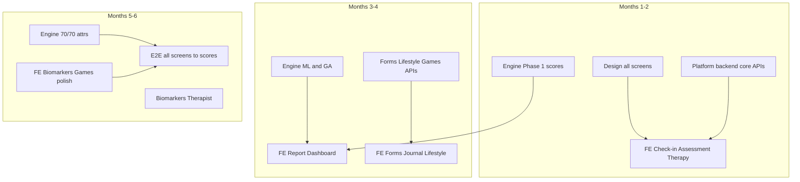

# Engine Part1 — Full-Stack Development Roadmap

**Document ID:** MP-PART1-FULLSTACK-001  
**Version:** 1.0.0  
**Date:** 2026-06-05  
**Audience:** Leadership, Product, Engineering (all disciplines)  
**Scope:** **Complete Engine Part1** — data engine, platform backend, mobile/web frontend, all 70 attributes, all product screens  
**Related:** [Development-Roadmap-Stakeholder.md](./Development-Roadmap-Stakeholder.md) · [Development-Roadmap-4Month-Accelerated.md](./Development-Roadmap-4Month-Accelerated.md) · [Engine-Part1-Full-Attribute-Binding-Spec.md](./Engine-Part1-Full-Attribute-Binding-Spec.md)

---

## 1. What “complete Part1” means

Engine Part1 is **not only the scoring engine**. A complete delivery includes **three stacks** that work together:

| Stack | What it is | User-visible? |
|-------|------------|---------------|
| **A — Data & scoring engine** | Ingest events → compute features → scores → daily report API | Indirect (powers the report) |
| **B — Platform backend** | App APIs, auth, forms, assessments, therapy booking, event emission | Yes (data capture) |
| **C — Frontend (mobile + web)** | All Part1 screens, report dashboard, five questions UI | Yes (primary UX) |

**Complete Part1 = A + B + C** with **70/70 attributes** flowing from user action → screen → API → event → score → dashboard.

```
┌─────────────────────────────────────────────────────────────────────────┐
│  FRONTEND (Mobile / Web)                                                │
│  Check-in · Assessment · Lifestyle · Games · Journal · Forms · Report   │
└───────────────────────────────┬─────────────────────────────────────────┘
                                │ REST / GraphQL
┌───────────────────────────────▼─────────────────────────────────────────┐
│  PLATFORM BACKEND (App services)                                        │
│  Auth · Profiles · Content · Therapy · Assessments · Event publisher    │
└───────────────────────────────┬─────────────────────────────────────────┘
                                │ events + reads
┌───────────────────────────────▼─────────────────────────────────────────┐
│  DATA & SCORING ENGINE (L0 → L2 → L3/L4 → L1 API)                       │
│  Ingestion · Features · ML · CRS · Pillars · Trends · Narrative         │
└─────────────────────────────────────────────────────────────────────────┘
```

**Previous roadmaps** ([Development-Roadmap-Stakeholder.md](./Development-Roadmap-Stakeholder.md)) covered **Stack A** only. This document adds **B + C**.

---

## 2. Product surface catalog (all Part1 screens)

Every row must ship for “complete Part1”:

| # | Product screen | User actions | Frontend work | Platform backend | Data engine | Attr IDs |
|---|----------------|--------------|---------------|------------------|-------------|----------|
| 1 | **Engine Report** | View CRS, pillars, trends, five questions | Dashboard UI, trend arrows, risk states | `GET /engine/report` proxy, cache | L3 scoring, L1 narrative API | Output |
| 2 | **Daily Check-in** | Mood, motivation, confidence | 3 input flows, validation, history | `POST /events` mood/motivation/confidence | L0 → L2 → pillars/trends | A27–A29 |
| 3 | **Assessment** | CORE-OM, GAD-7, PHQ-9, trauma, ADHD | Multi-step forms, scoring display | Assessment service, `assessment_completed` | Clinical features, labels, risk cap | A01–A10 |
| 4 | **Lifestyle Tracker** | Sleep view, fatigue, exercise, nutrition, hydration, hunger, sun, libido | Tracker UI, wearable connect | Lifestyle API, `lifestyle_checkin`, wearable sync | L2 lifestyle cols | A11–A20 |
| 5 | **Wearable settings** | Connect Apple/Google, permissions | OAuth flows, status | Wearable connector webhooks | `sleep_session`, `heart_rate_daily` | A11, A13–A14 |
| 6 | **Brain Games** | Memory, Connect Four, Whack-a-Mole | Game UIs, score submit | `game_session_completed` | Game L2 features | A30–A32 |
| 7 | **Journaling** | Blank slate, letter to self, gratitude | Editors, privacy, submit | `journal_entry` → NLP worker | Journal sentiment features | A33–A36 |
| 8 | **Intake / Forms** | 21 Part1 form fields, free text | Dynamic form, progress save | `intake_form_submitted`, NLP async | 21× `form_*` L2 cols | A44–A64 |
| 9 | **Therapy & sessions** | Book, attend, cancel, reminders | Calendar, session list | Therapy platform integration | `session_*`, attendance rates | A43, A66–A67 |
| 10 | **Biomarkers** | View labs, consent, upload results | Consent UI, results display | `biomarker_result`, consent flag | Biomarker L2 latest-value | A21–A26 |
| 11 | **Therapist matching** | Availability, affordability, match | Therapist card (read-only v1) | `therapist_profile_sync` (sheet) | Therapist score cols | A68–A70 |
| 12 | **Guides & engagement** | Content views, focus mode, tasks | Content library, task completion | `content_viewed`, `app_session` | Engagement features | A37–A42 |
| 13 | **Onboarding / profile** | system_type, biomarker consent | Onboarding wizard | `user_profile_updated` | Meta flags | — |

**Report screen (row 1)** is the capstone — it consumes the engine API. **Rows 2–12** are **input surfaces** that feed the engine.

---

## 3. Workstreams

### WS-A — Data & scoring engine (Stacks A)

| Component | Deliverable | Spec |
|-----------|-------------|------|
| L0 ingestion | All v1 + v1.1 events | [Data Ingestion](../Data-Ingestion-Layer-Production-Spec.md) |
| L2 features | 86 columns `feature_v2.0.0` | [L2 Feature Store](../L2-Feature-Store-Production-Spec.md) |
| L4 ML | Labels + 4 models + inference | [CRS Unified v3 §4–5](../CRS-Calculation-and-Trends-Production-Spec-Unified-v3.md) |
| L3 scoring | CRS v2 + readiness + pillars + trends | [CRS Unified v3 §6–8](../CRS-Calculation-and-Trends-Production-Spec-Unified-v3.md) |
| L1 API | Report + trend series + narrative | [CRS Unified v3 §10](../CRS-Calculation-and-Trends-Production-Spec-Unified-v3.md) |

**Team:** 8–9 engineers (see [4-month accelerated plan](./Development-Roadmap-4Month-Accelerated.md))

---

### WS-B — Platform backend (Stack B)

Services the **mobile/web app** uses; publishes events the engine consumes.

| Service | Responsibilities | Key APIs |
|---------|------------------|----------|
| **Auth & users** | JWT/OAuth, `user_id`, `system_type`, consent flags | `/auth/*`, `/users/{id}/profile` |
| **Event gateway** | Validate + forward to L0 (`POST /v1/events`) | Idempotency, schema validation |
| **Check-in service** | Mood, motivation, confidence | CRUD + emit events |
| **Assessment service** | CORE-OM, GAD-7, PHQ-9, PTSD, ASRS flows | Schedule, submit, `assessment_completed` |
| **Lifestyle service** | Manual lifestyle + wearable token storage | `lifestyle_checkin`, wearable callbacks |
| **Games service** | Session start/end, scores | `game_session_completed` |
| **Journal service** | Store entries, trigger NLP worker | `journal_entry`, `journal_features_computed` |
| **Forms service** | Intake onboarding, 21 fields | `intake_form_submitted` |
| **Therapy service** | Sessions, attendance webhooks | `session_scheduled/attended/missed` |
| **Biomarker service** | Lab partner or manual upload | `biomarker_result` + consent |
| **Engine BFF** | Thin proxy to L1 snapshot API | `/users/{id}/engine/report` for app |

**Team:** 3–4 backend engineers (can overlap with engine backend if same codebase monorepo)

---

### WS-C — Frontend (Stack C)

| Platform | Screens (priority) | Notes |
|----------|-------------------|--------|
| **Mobile (primary)** | Report, Check-in, Assessment, Lifestyle, Games, Journal, Forms, Therapy | React Native or native iOS+Android |
| **Web (secondary)** | Report, Check-in, Assessment, Forms | Parity or subset for v1 |
| **Shared** | Design system, score bands, risk-elevated states, empty states | Figma from Part1 |

**Per-screen frontend deliverables:**

| Screen | UI components | API integration | Event emission |
|--------|---------------|-----------------|----------------|
| Engine Report | CRS card, 4 pillars, 7 trends, narrative blocks | Engine BFF | — |
| Check-in | Sliders 0–5/0–10, streak, reminder | Check-in service | On submit |
| Assessment | Wizard, progress, clinical disclaimers | Assessment service | On complete |
| Lifestyle | Daily log form, wearable status | Lifestyle service | On save |
| Games | 3 game shells + score handoff | Games service | On session end |
| Journal | Rich text, type picker | Journal service | On publish |
| Forms | Multi-page intake | Forms service | On submit |
| Therapy | Session list, book CTA | Therapy service | Via platform webhooks |
| Biomarkers | Consent + results list | Biomarker service | On result available |

**Team:** 4–6 frontend engineers (2–3 mobile, 1–2 web, 1 shared UI lead)

---

### WS-D — Cross-cutting

| Function | Owner | Deliverable |
|----------|-------|-------------|
| **Design** | 1–2 designers | Figma: all screens + report + risk states |
| **QA** | 2 QA | E2E: action on screen → event → score updates next day |
| **Clinical** | Clinical lead | Copy, risk UX, assessment flows |
| **Product** | PM | Screen priority, acceptance per wave |
| **DevOps** | 1 | CI/CD mobile + backend + batch jobs |

---

## 4. Implementation waves (full stack)

Aligned with engine waves W1–W7 + frontend/backend per wave.

| Wave | Weeks | Engine | Platform backend | Frontend | Part1 % |
|------|-------|--------|------------------|----------|---------|
| **W0** | 1 | Spec sign-off | API skeleton, auth | Design system start | 0% |
| **W1** | 2–4 | Phase 1 engine (18 attrs) | Check-in, assessment, wearable, therapy APIs | Check-in, assessment v1, therapy list | **26%** |
| **W2** | 5–7 | ML models + Wave A engine | Lifestyle API, games API | Lifestyle UI, games (2 of 3) | **40%** |
| **W3** | 8–10 | Shadow + **GA engine** + Wave B | Forms API, journal API | **Engine Report v1**, forms, journal | **55%** |
| **W4** | 11–13 | Wave C assessments engine | PHQ-9, PTSD, ASRS backend | Assessment expansion, report polish | **65%** |
| **W5** | 14–16 | Wave D biomarkers + therapist | Biomarker + sheet sync | Biomarker UI, therapist card | **85%** |
| **W6** | 17–18 | `feature_v2.0.0` integration | App behaviour events | Games complete, guides, focus mode | **100%** |

**User-facing “complete Part1”** = end of **W6** (not engine-only week 17).

---

## 5. Resource distribution — full stack

**Working assumption:** 6 hours/day, 5 days/week = **30 hours/week** per person.

### 5.1 Team size options

| Plan | Calendar | Total people | Engineering | Complete Part1? |
|------|----------|--------------|-------------|-----------------|
| **Engine only** (prior docs) | 4 months | 8–9 | 8–9 eng | Data only — **no UI** |
| **Pragmatic full stack** | **6 months** | **14–16** | 12–14 eng + 2 QA | **Yes** — recommended |
| **Aggressive full stack** | **4 months** | **18–20** | 16–18 eng + 2 QA | **Yes** — high risk |
| **Phased full stack** | 4 mo engine + 3 mo UI | 10–12 | Staged hiring | Report at month 4; inputs by month 7 |

### 5.2 Recommended team (6-month complete Part1)

| Squad | Roles | Count | Hours/week |
|-------|-------|-------|------------|
| **Engine** | Lead, data ×2, ML, backend (scoring/API), DevOps | 6–7 | 30 |
| **Platform backend** | Backend ×2 (services + BFF), 1 integrator (therapy/wearable) | 3 | 30 |
| **Mobile** | RN or iOS + Android ×2, mobile lead | 3–4 | 30 |
| **Web** | Frontend ×1 (parity subset) | 1 | 30 |
| **Design** | Product designer ×1, UX ×0.5 | 1–2 | 20–30 |
| **QA** | Manual + automation | 2 | 30 |
| **Total** | | **16–19** | |

### 5.3 Aggressive 4-month full stack (18–20 people)

| Squad | Count | Notes |
|-------|-------|-------|
| Engine (WS-A) | 8–9 | Unchanged from [4-month plan](./Development-Roadmap-4Month-Accelerated.md) |
| Platform backend (WS-B) | 4 | Start week 1; parallel service development |
| Mobile (WS-C) | 4 | 2 screens/week after week 4 |
| Web (WS-C) | 2 | Report + check-in web minimum |
| Design | 2 | All screens upfront in Figma week 1–2 |
| QA | 2 | E2E from week 8 |
| **Total** | **20–23** | Budget ~6,000 eng-hours in 17 weeks |

**Honest assessment:** 4 months for **everything** requires nearly **double** the engine-only team and **pre-built** design assets. Most organizations plan **6 months** for complete Part1 full stack.

---

## 6. Hours budget (full stack, 6-month plan)

| Workstream | Est. hours | % of total |
|------------|------------|------------|
| WS-A Data & scoring engine | 4,000 | 35% |
| WS-B Platform backend | 2,400 | 21% |
| WS-C Mobile frontend | 3,600 | 31% |
| WS-C Web frontend | 800 | 7% |
| WS-D QA + E2E | 720 | 6% |
| **Total engineering** | **~11,500** | 100% |

At 30 h/week: 11,500 ÷ 30 ÷ 26 weeks ≈ **15 FTE** over 6 months — matches §5.2.

---

## 7. Critical path (full stack)



---

## 8. Definition of done — complete Part1

### 8.1 Per screen

- [ ] UI matches approved Figma
- [ ] User action persists via platform backend
- [ ] Correct L0 `event_type` emitted with idempotency
- [ ] L2 column populated within 24h
- [ ] Contributes to correct pillar / trend per [binding spec](./Engine-Part1-Full-Attribute-Binding-Spec.md)
- [ ] Visible impact on Engine Report (or documented null path)

### 8.2 Program level

- [ ] **70/70** attributes live end-to-end
- [ ] Engine Report shows CRS v2, readiness, 4 pillars, 7 trends, five questions
- [ ] Risk cap UX (scores capped + escalation copy)
- [ ] Web-only and wearable paths both work
- [ ] E2E test suite: 12 screens → next-day score change
- [ ] Clinical + product sign-off

---

## 9. What to build first (priority order)

If capacity is limited, ship in this order for maximum user value:

| Priority | Screen / capability | Why |
|----------|---------------------|-----|
| P0 | Engine Report (read-only) | Proves value even with thin data |
| P0 | Daily Check-in | Highest frequency signal |
| P0 | Assessment (CORE-OM + GAD-7) | Clinical anchor + risk cap |
| P1 | Therapy sessions | Dropout label + Capacity pillar |
| P1 | Wearable + sleep | Biological trends |
| P2 | Intake forms | 21 attrs in one wave |
| P2 | Lifestyle tracker | Energy / recovery trends |
| P3 | Games + journal | Cognitive + emotional depth |
| P3 | Biomarkers + therapist sheet | Last 15% attrs; partner dependent |

---

## 10. Dependencies on other teams

| Dependency | Blocks | Owner |
|------------|--------|-------|
| Figma Part1 screens approved | All frontend | Design |
| Therapy platform API | Session events | Partnerships |
| Wearable OAuth (Apple/Google) | Sleep, HRV | Mobile + platform |
| Lab partner or CSV import | Biomarkers | Business dev |
| Therapist Google Sheet access | A68–A70 | Operations |
| App Store / Play release process | GA | Mobile lead |

---

## 11. 4-month vs 6-month recommendation

| If your deadline is… | Plan |
|---------------------|------|
| **4 months** | Either **engine + report UI only** (8–9 eng + 3 mobile), **or** full Part1 with **20+ people** |
| **6 months** | **Complete Part1 full stack** with **15–17 people** — realistic |
| **4 months engine + 3 months UI** | **10–12 people** staged; users see report at month 4, all inputs by month 7 |

---

## 12. Document map

| Question | Read |
|----------|------|
| Scoring formulas, ML, API | [CRS Unified v3](../CRS-Calculation-and-Trends-Production-Spec-Unified-v3.md) |
| 70 attributes → scores | [Engine-Part1-Full-Attribute-Binding-Spec.md](./Engine-Part1-Full-Attribute-Binding-Spec.md) |
| Engine-only 4-month plan | [Development-Roadmap-4Month-Accelerated.md](./Development-Roadmap-4Month-Accelerated.md) |
| Stakeholder timeline | [Development-Roadmap-Stakeholder.md](./Development-Roadmap-Stakeholder.md) |
| Screen → event lineage | [CRS Unified Appendix G](../CRS-Calculation-and-Trends-Production-Spec-Unified-v3.md#appendix-g--screen--l0--l2-lineage) |

---

## Revision history

| Version | Date | Changes |
|---------|------|---------|
| 1.0.0 | 2026-06-05 | Initial full-stack Part1 roadmap (engine + platform backend + frontend) |

---

*Complete Part1 = users can **do** every input action on screen **and** see the impact on the Engine Report the next day.*
