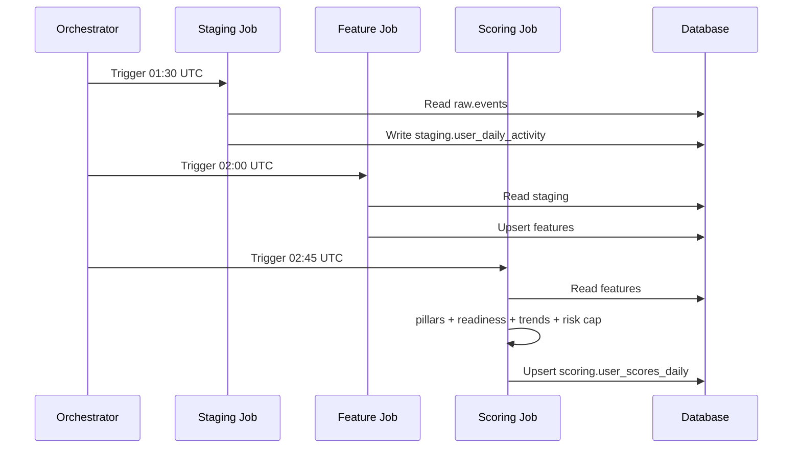

# Phase 01 HLD — Foundation (L0 + L2 + L3 Rule-Based)

**Document ID:** MP-ENGINE-HLD-P01  
**Version:** 1.0.0  
**Phase:** 1 — Foundation  
**Timeline:** Weeks 1–4

---

## 1. Component diagram

```
┌──────────────────────────────────────────────────────────────────────────┐
│                         PHASE 1 SCOPE                                     │
├──────────────────────────────────────────────────────────────────────────┤
│                                                                          │
│  ┌─────────────┐   ┌─────────────┐   ┌─────────────┐   ┌─────────────┐ │
│  │ AppConnector│   │WearableConn │   │ TherapyConn │   │ AssessConn  │ │
│  └──────┬──────┘   └──────┬──────┘   └──────┬──────┘   └──────┬──────┘ │
│         └─────────────────┴────────┬────────┴─────────────────┘         │
│                                    ▼                                     │
│                         ┌─────────────────────┐                          │
│                         │  IngestionService   │                          │
│                         │  + SchemaValidator  │                          │
│                         └──────────┬──────────┘                          │
│                                    ▼                                     │
│                         ┌─────────────────────┐                          │
│                         │    raw.events       │                          │
│                         └──────────┬──────────┘                          │
│                                    ▼ 01:30 UTC                           │
│                         ┌─────────────────────┐                          │
│                         │  StagingRollupJob   │                          │
│                         │  user_daily_activity│                          │
│                         └──────────┬──────────┘                          │
│                                    ▼ 02:00 UTC                           │
│                         ┌─────────────────────┐                          │
│                         │  FeaturePipeline    │                          │
│                         │  (34 columns)       │                          │
│                         └──────────┬──────────┘                          │
│                                    ▼ 02:45 UTC                           │
│                         ┌─────────────────────┐                          │
│                         │  RuleScoringService │                          │
│                         │  pillars+readiness  │                          │
│                         │  trends + risk cap  │                          │
│                         └──────────┬──────────┘                          │
│                                    ▼                                     │
│                         ┌─────────────────────┐                          │
│                         │ user_scores_daily   │                          │
│                         └─────────────────────┘                          │
└──────────────────────────────────────────────────────────────────────────┘
```

---

## 2. L0 design

### 2.1 Connector pattern

```python
# Conceptual interface (see ingestion/connectors/base.py)
class BaseConnector:
    connector_id: str
    def fetch_events(user_id, since) -> Iterator[Event]
    def publish(event) -> IngestionResult  # validate + dedupe + persist
```

| Connector | Source | Events |
|-----------|--------|--------|
| `app_mobile` | App API | mood, motivation, confidence, app_session |
| `wearable_apple` | HealthKit sync | sleep_session, heart_rate_daily |
| `therapy_platform` | Therapy API | session_attended, session_missed |
| `assessments` | Assessment service | assessment_completed |
| `auth_crm` | CRM | user_registered, user_churned |

### 2.2 Validation pipeline

```
Event JSON → envelope schema → payload schema → business rules → raw.events
                    │ fail
                    ▼
              quarantine.events
```

### 2.3 Staging rollup

**Input:** `raw.events` for `local_date = D`  
**Output:** one row per `(user_id, local_date)` with aggregated flags and latest values

Key fields: `mood_score`, `sleep_hours`, `engaged`, `therapy_attended`, `assessment_ids`

---

## 3. L2 design

### 3.1 Feature computation flow

```
FOR each (user_id, as_of_date):
  load staging series [D-29 .. D]
  compute window features (mean, std, slope, delta)
  lookup latest CORE-OM / GAD-7
  compute flags + meta
  UPSERT features.user_features_daily
```

### 3.2 Key algorithms

| Feature | Algorithm | Min points |
|---------|-----------|------------|
| `mood_slope_7d` | OLS slope | 4 |
| `engagement_rate_7d` | active_days / 7 | 1 |
| `core_om_delta_30d` | norm_total(D) − norm_total(D−30) | 2 assessments |

Reference: [L2 spec §8](../../L2-Feature-Store-Production-Spec.md)

---

## 4. L3 rule-based scoring design

### 4.1 Pillar computation (Part1)

```
FOR each pillar:
  FOR each category (Assessment, Lifestyle, Tools, Forms, Therapist):
    block_score = mean(normalized available parameters)
    renormalize category weights if block missing
  pillar_score = weighted_sum(categories)
  apply_risk_cap(pillar_score)
```

Category weights per pillar: CRS Unified v3 §7.6

### 4.2 CRS readiness

```
crs_readiness = 0.30×Assessment + 0.30×Lifestyle + 0.15×Tools + 0.15×Forms + 0.10×Therapist
cognitive_readiness_score = crs_readiness  // Phase 1 only
```

### 4.3 Risk cap

```
IF features.core_om_risk >= 0.70:
  ALL display scores = MIN(score, 40)
  risk_elevated = true
```

### 4.4 Trends

Seven composites from L2 features + historical snapshots. Direction via `compute_direction(score_now, score_7d_ago, threshold=3)`.

---

## 5. Database schema (high level)

```sql
-- raw.events (simplified)
CREATE TABLE raw.events (
  event_id        TEXT PRIMARY KEY,
  idempotency_key TEXT UNIQUE NOT NULL,
  user_id         TEXT NOT NULL,
  event_type      TEXT NOT NULL,
  occurred_at     TIMESTAMPTZ NOT NULL,
  local_date      DATE NOT NULL,
  payload         JSONB NOT NULL,
  ingested_at     TIMESTAMPTZ DEFAULT now()
);

-- staging.user_daily_activity
CREATE TABLE staging.user_daily_activity (
  user_id         TEXT NOT NULL,
  local_date      DATE NOT NULL,
  system_type     SMALLINT DEFAULT 1,
  mood_score      REAL,
  sleep_hours     REAL,
  engaged         BOOLEAN DEFAULT false,
  therapy_attended BOOLEAN DEFAULT false,
  PRIMARY KEY (user_id, local_date)
);

-- features.user_features_daily
CREATE TABLE features.user_features_daily (
  user_id         TEXT NOT NULL,
  as_of_date      DATE NOT NULL,
  feature_version TEXT NOT NULL,
  -- 34 feature columns ...
  days_active     INT,
  data_completeness_score REAL,
  PRIMARY KEY (user_id, as_of_date)
);

-- scoring.user_scores_daily
CREATE TABLE scoring.user_scores_daily (
  user_id         TEXT NOT NULL,
  as_of_date      DATE NOT NULL,
  score_version   TEXT NOT NULL,
  cognitive_readiness_score REAL,
  crs_readiness_score REAL,
  clarity_score   REAL,
  emotional_balance_score REAL,
  resilience_score REAL,
  capacity_score  REAL,
  risk_elevated   BOOLEAN DEFAULT false,
  trends_json     JSONB,
  PRIMARY KEY (user_id, as_of_date)
);
```

---

## 6. Sequence — daily batch (Phase 1)



---

## 7. Deployment (Phase 1)

| Component | Deployment unit | Scaling |
|-----------|-----------------|---------|
| Connectors | K8s cron + stream consumers | Per source |
| Validator | Library in ingestion service | — |
| Staging job | Batch worker | Horizontal by date shard |
| Feature job | Batch worker | Horizontal by user_id hash |
| Scoring job | Batch worker | Horizontal by user_id hash |

---

## 8. Observability

| Metric | Alert |
|--------|-------|
| `ingestion.events_quarantined_rate` | > 2% |
| `staging.rows_written` | < expected cohort |
| `features.null_rate{column}` | > 15% required |
| `scoring.job_duration_seconds` | > 1800 |

---

## 9. Week-by-week delivery

| Week | Deliverable |
|------|-------------|
| 1 | L0 schemas + app/wearable connectors + raw.events |
| 2 | Therapy + assessment connectors + staging rollup |
| 3 | L2 feature job (34 cols) + validation scripts |
| 4 | L3 rule scoring + risk cap + E2E staging test |

---

## 10. References

- [Phase 01 TRD](./Phase-01-TRD.md)
- [schemas/ingestion/](../../schemas/ingestion/)
- [ingestion/](../../ingestion/)
- [features/](../../features/)
