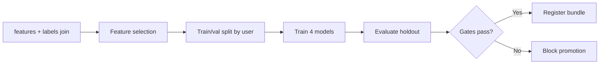

# Phase 02 HLD — ML Labels & Model Training

**Document ID:** MP-ENGINE-HLD-P02  
**Version:** 1.0.0  
**Phase:** 2 — ML Labels & Training

---

## 1. Architecture

```
┌─────────────────────────────────────────────────────────────────┐
│                    PHASE 2 — ML LAYER                            │
├─────────────────────────────────────────────────────────────────┤
│                                                                  │
│  raw.events (assessments, churn)                                 │
│         │                                                        │
│         ▼ 02:15 UTC                                              │
│  ┌──────────────────┐                                            │
│  │ LabelGeneration  │──► ml.training_labels                      │
│  │ Job              │                                            │
│  └──────────────────┘                                            │
│                                                                  │
│  features.user_features_daily                                    │
│         │                                                        │
│         ├──────────────────────┐                                 │
│         ▼                      ▼                                 │
│  ┌──────────────────┐   ┌──────────────────┐                  │
│  │ TrainingPipeline │   │ InferenceJob     │                  │
│  │ (offline)        │   │ (daily batch)    │                  │
│  └────────┬─────────┘   └────────┬─────────┘                  │
│           ▼                      ▼                                 │
│  ┌──────────────────┐   ┌──────────────────┐                  │
│  │ ml.model_registry│   │ ml.predictions   │                  │
│  │ (MLflow)         │   │ _daily           │                  │
│  └──────────────────┘   └──────────────────┘                  │
│                                                                  │
└─────────────────────────────────────────────────────────────────┘
```

---

## 2. Label generation design

### 2.1 Processing logic

```
FOR each snapshot_date T where T <= today - 45 days:
  baseline_core_om = nearest on/before T
  followup_core_om = nearest in [T+21, T+45]
  
  IF no followup AND no GAD-7 secondary:
    recovery_label = null, relapse_label = null
  ELSE IF any L1-L5:
    relapse=1, recovery=0
  ELSE IF any R1-R4 + risk guard:
    recovery=1, relapse=0
  ELSE:
    recovery=0, relapse=0
  
  dropout_label = evaluate_churn_inactivity(T, T+60)
  engagement_loss_label = evaluate_engagement_drop(T, T+14)
  
  UPSERT ml.training_labels
```

### 2.2 Data sources

| Label | L0 events | L2 features |
|-------|-----------|-------------|
| recovery/relapse | `assessment_completed` | — |
| dropout | `user_churned`, `app_session`, `session_attended` | `engagement_rate_7d` |
| engagement_loss | — | `engagement_rate_7d` at T and T+14 |

---

## 3. Training pipeline

### 3.1 Flow



### 3.2 Feature set

All 34 L2 v1 features + meta (`days_active`, `data_completeness_score`). Exclude label columns from inference features.

### 3.3 Hyperparameters (starting point)

| Param | Value |
|-------|-------|
| max_depth | 6 |
| learning_rate | 0.05 |
| n_estimators | 500 |
| class_weight | balanced |

Tune per model on validation set.

---

## 4. Inference design

```
INPUT:  features.user_features_daily (as_of_date = D)
        model_bundle_version = production pointer

FOR each active user:
  recovery_prob    = recovery_model.predict_proba(features)
  relapse_prob     = relapse_model.predict_proba(features)
  dropout_prob     = dropout_model.predict_proba(features)
  engagement_prob  = engagement_loss_model.predict_proba(features)
  shap_top5        = compute_shap(model, features)

OUTPUT: ml.predictions_daily
```

### 4.1 Output schema

```sql
CREATE TABLE ml.predictions_daily (
  user_id         TEXT NOT NULL,
  as_of_date      DATE NOT NULL,
  model_bundle_version TEXT NOT NULL,
  recovery_probability REAL,
  relapse_probability REAL,
  dropout_probability REAL,
  engagement_loss_probability REAL,
  shap_json       JSONB,
  PRIMARY KEY (user_id, as_of_date, model_bundle_version)
);
```

---

## 5. Model registry

| Field | Example |
|-------|---------|
| model_bundle_version | `outcome_models_v1.0.0` |
| label_version | `label_v2.0.0` |
| feature_version | `feature_v1.0.0` |
| training_date | 2026-07-01 |
| holdout_metrics | JSON |
| artifact_uri | s3://mlflow/... |

Promotion workflow: Data Science proposes → Clinical reviews relapse/recovery metrics → Engineering deploys pointer.

---

## 6. Monitoring (Phase 2 baseline)

| Check | Frequency |
|-------|-----------|
| Prediction distribution | Daily |
| Label positive rate | Weekly |
| Feature null rate | Daily |
| SHAP stability sample | Weekly |

Full alerting in Phase 4.

---

## 7. Week-by-week delivery

| Week | Deliverable |
|------|-------------|
| 5 | Label job + backfill 90d labels |
| 6 | Training pipeline + recovery/dropout models |
| 7 | Relapse/engagement models + holdout eval |
| 8 | Inference job + registry + integration test with L3 |

---

## 8. References

- [Phase 02 TRD](./Phase-02-TRD.md)
- [Appendix B.1 label decision tree](../../CRS-Calculation-and-Trends-Production-Spec-Unified-v3.md)
