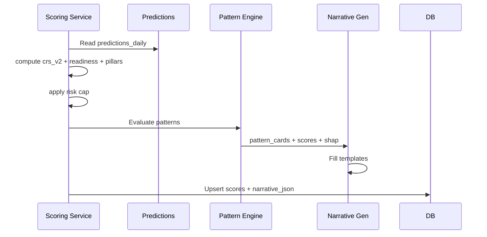

# Phase 03 HLD — CRS v2 Shadow & Narrative

**Document ID:** MP-ENGINE-HLD-P03  
**Version:** 1.0.0  
**Phase:** 3

---

## 1. Scoring flow (dual path)

```
features.user_features_daily
         │
         ├─────────────────────────────┐
         ▼                             ▼
┌─────────────────┐          ┌─────────────────┐
│ RuleScoring     │          │ ML Inference    │
│ (Phase 1)       │          │ (Phase 2)       │
│ readiness       │          │ 4 probabilities │
│ pillars         │          └────────┬────────┘
│ trends          │                   ▼
└────────┬────────┘          ┌─────────────────┐
         │                   │ CRS v2 Composite│
         │                   └────────┬────────┘
         └───────────┬────────────────┘
                     ▼
            ┌─────────────────┐
            │ Risk Cap §7.7   │
            └────────┬────────┘
                     ▼
            ┌─────────────────┐
            │ Narrative Gen   │◄── patterns
            └────────┬────────┘
                     ▼
            scoring.user_scores_daily (+ narrative_json)
```

---

## 2. CRS v2 composite service

```python
def compute_crs_v2(recovery, dropout, engagement_loss, relapse) -> float:
    return round(
        0.40 * recovery * 100
        + 0.20 * (1 - dropout) * 100
        + 0.20 * (1 - engagement_loss) * 100
        + 0.20 * (1 - relapse) * 100,
        1,
    )
```

Joined with Phase 1 outputs in single `ScoringOrchestrator` step.

---

## 3. Shadow analytics job

```
Daily after scoring:
  INSERT INTO analytics.crs_shadow_daily
  SELECT user_id, as_of_date,
         crs_v2_score, crs_readiness_score,
         crs_v2_score - crs_readiness_score AS delta
  FROM scoring.user_scores_daily
```

Product dashboard: histogram of delta, segment breakdown.

---

## 4. Narrative generator design

### 4.1 Template engine (no LLM)

| Block | Template inputs |
|-------|-----------------|
| where_now | `crs_band`, pillar scores, lowest pillar name |
| why_summary | top 3 SHAP features → category labels |
| awareness_flags | trends where `direction_7d = declining` |
| risk | `relapse_probability`, `core_om_risk`, `risk_elevated` |
| next_actions | pattern_id → action catalog |

### 4.2 SHAP → Part1 category map

| SHAP domain | Narrative category |
|-------------|-------------------|
| biological | Lifestyle + Biomarker |
| behavioral | Tools / Behavioural |
| psychological | Assessment + Forms |
| clinical | Assessment |
| therapy | Therapist / Session |

### 4.3 Risk override branch

```
IF risk_elevated:
  SKIP positive readiness templates
  USE escalation template set
  SET escalation_recommended = true
```

---

## 5. Pattern engine (minimal)

| Pattern ID | Trigger condition |
|------------|-------------------|
| `motivation_decline_warning` | `motivation_momentum` direction declining AND score < 45 |
| `risk_watch` | `risk_elevated` OR `relapse_probability > 0.5` |
| `engagement_drop` | `engagement_loss_probability > 0.45` |

```json
{
  "pattern_id": "motivation_decline_warning",
  "type": "warning",
  "title": "Engagement momentum declining",
  "summary": "..."
}
```

---

## 6. Sequence — scoring + narrative



---

## 7. Week delivery

| Week | Deliverable |
|------|-------------|
| 9 | CRS v2 composite + shadow analytics + internal API |
| 10 | Narrative generator + patterns + QA review |

---

## 8. References

- [Phase 03 TRD](./Phase-03-TRD.md)
