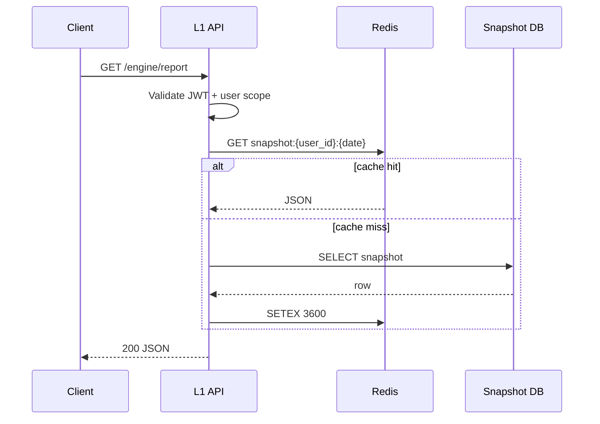

# Phase 04 HLD — Production Cutover & L1 API GA

**Document ID:** MP-ENGINE-HLD-P04  
**Version:** 1.0.0  
**Phase:** 4

---

## 1. Production architecture

```
                    ┌─────────────────────────────────────┐
                    │           CDN / API Gateway          │
                    │         TLS, rate limit, WAF         │
                    └──────────────────┬──────────────────┘
                                       │
                    ┌──────────────────▼──────────────────┐
                    │         L1 Engine API Service          │
                    │  GET /engine/report                    │
                    │  GET /engine/trends/{id}/series        │
                    └──────────────────┬──────────────────┘
                                       │ read
              ┌────────────────────────┼────────────────────────┐
              ▼                        ▼                        ▼
     ┌─────────────────┐     ┌─────────────────┐     ┌─────────────────┐
     │ Redis cache     │     │ user_engine_    │     │ Read replica    │
     │ snapshot TTL 1h │────►│ snapshot (PG)   │◄────│ (optional)      │
     └─────────────────┘     └─────────────────┘     └─────────────────┘

     Batch pipeline (03:05 UTC) ──writes──► user_engine_snapshot
```

---

## 2. CRS primary selection logic

```python
def select_crs_primary(maturity_stage, completeness, models_available, force_env):
    if force_env == "readiness":
        return "readiness"
    if not models_available:
        return "readiness"
    if maturity_stage == "full" and completeness >= 0.7:
        return "v2"
    return "readiness"

def headline_score(primary, crs_v2, crs_readiness):
    return crs_v2 if primary == "v2" else crs_readiness
```

---

## 3. Snapshot schema

```sql
CREATE TABLE user_engine_snapshot (
  user_id              TEXT NOT NULL,
  as_of_date           DATE NOT NULL,
  computed_at          TIMESTAMPTZ NOT NULL,
  score_version        TEXT NOT NULL,
  model_bundle_version TEXT,
  feature_version      TEXT NOT NULL,
  crs_primary          TEXT NOT NULL,
  cognitive_readiness_score REAL,
  crs_v2_score         REAL,
  crs_readiness_score  REAL,
  risk_elevated        BOOLEAN,
  pillars_json         JSONB NOT NULL,
  trends_json          JSONB NOT NULL,
  outcome_probs_json   JSONB,
  crs_breakdown_json   JSONB,
  narrative_json       JSONB,
  drivers_json         JSONB,
  pattern_cards_json   JSONB,
  confidence_tier      TEXT,
  PRIMARY KEY (user_id, as_of_date)
);
```

---

## 4. API read path



**Critical:** API never invokes scoring or ML — read-only.

---

## 5. Monitoring stack

| Component | Tool | Dashboard |
|-----------|------|-----------|
| API metrics | Prometheus + Grafana | Latency, 5xx rate |
| Batch jobs | Airflow + PagerDuty | SLA misses |
| ML drift | Custom + MLflow | CRS distribution, AUC |
| Logs | ELK / CloudWatch | Correlation by user_id hash |

### 5.1 Alert thresholds (from CRS §14.2)

| Metric | Threshold |
|--------|-----------|
| CRS mean shift | ±3 points cohort-wide |
| KL divergence | > 0.1 |
| AUC drop | > 5% |
| Required feature null rate | > 15% |

---

## 6. Deployment

| Service | Strategy |
|---------|----------|
| L1 API | Blue/green; K8s HPA on CPU |
| Scoring batch | Versioned container; `score_version` env |
| Model bundle | Registry pointer swap — no API redeploy |

---

## 7. Security

- API: OAuth2 bearer; `user_id` in token must match path
- Snapshot DB: encrypted at rest; no direct client access
- Audit log: all API reads (hashed user_id)
- PHI: narrative never logged at INFO level in prod

---

## 8. References

- [Phase 04 TRD](./Phase-04-TRD.md)
